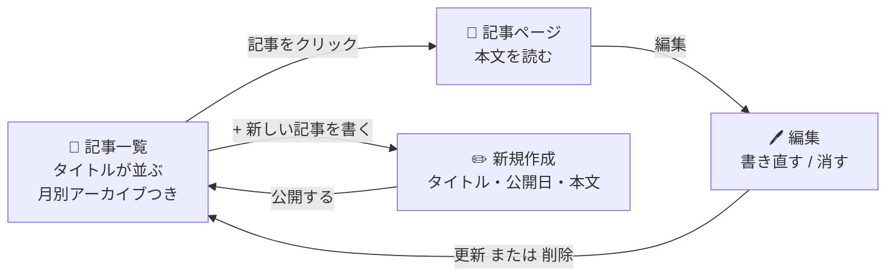
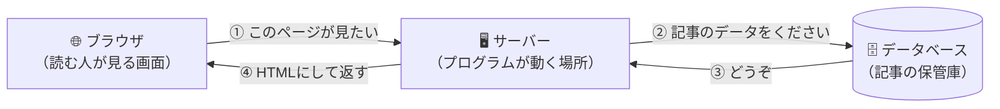

# はじめに

## このガイドについて

このガイドでは、Laravel（ララベル）という道具を使って、自分のブログを作ります。
そして最後に、インターネットに公開します。

プログラミングが初めてでも大丈夫です。順番に進めれば、1日で
スマホからも開ける「自分のブログのURL」が手に入ります。家族や友達に、その場で見せられます。

### この日のゴール

1. 動くWebアプリケーションを、自分の手で作る
2. インターネットに公開して、自分のURLを手に入れる
3. デザインや文言を自分色にカスタマイズする

すべてを理解する必要はありません。分からない言葉が出てきても、まずは手を動かして先に進んでください。

## 何を作るの？

記事を書いて公開できる、シンプルなブログです。

できること。

- 記事を書いて公開する
- 記事を読む
- 記事を編集する
- 記事を削除する
- 月別アーカイブで絞り込む

書いた記事はデータベースに保存されるので、アプリを閉じても消えません。

## そもそも「Webアプリ」って？

ブラウザで使うアプリのことです。X（旧Twitter）も、Amazonも、note も Webアプリです。

Webアプリは、ざっくり言うとこのやりとりでできています。

- ブラウザ… Chrome や Safari。読む人が触るところ
- サーバー…プログラムが動くところ
- データベース…書いた記事を保存しておくところ

このガイドでは、この「サーバー」の部分を Laravel で作ります。

### 「作る」と「公開する」の違い

最初は自分のパソコンの中だけでブログが動きます（他の人はまだ見られません）。
最後にインターネット上のサーバーへ引っ越すことで、誰でも見られるようになります。

### Laravel（ララベル）とは？

Webアプリを作るための「便利な部品セット」です。こういうものをフレームワークと呼びます。

一からすべて書くと大変な処理（データベースとのやりとり、URLの振り分け、セキュリティ対策など）を、Laravel が肩代わりしてくれます。

このガイドでは Laravel 13 を使います。

## 必要なもの

- パソコン（macOS または Windows）
- インターネット接続
- GitHubアカウント（06 で使います。まだなくても大丈夫です）

プログラミングの経験は必要ありません。

> 💡 インターネットへの公開（07）について
> 公開先の Render は無料で、クレジットカードの入力も求められません。
> ただし無料プランのため、書いた記事は約1か月で読めなくなります（データベースの期限）。
> また、しばらくアクセスがないと停止するので、久しぶりに開くと最初だけ1分ほどかかります。
> 詳しくは [07 のはじめの説明](./07.md) を読むか、メンターに相談してください。

## ガイドの進め方

### 1. 番号順に進める

このガイドは番号順に進める前提で作られています。
後のステップは前のステップで作ったものを使うので、飛ばさずに順番に進めてください。

### 2. コードはコピー＆ペーストでOK

このガイドに出てくるコードは、すべてコピー＆ペーストで大丈夫です。手で打ち込む必要はありません。

覚えるより、まず動かすことを優先してください。

### 3. 分からない言葉は流してOK

初めて見る言葉がたくさん出てきますが、その場で全部理解しようとしなくて大丈夫です。
使っているうちに、だんだん意味が分かってきます。

### 4. メンターに質問する

わからないことがあったら、遠慮なくメンターに質問してください。エラーが出たときも、一緒に解決していきましょう。

質問することは、恥ずかしいことではありません。プロのエンジニアも毎日質問しています。

## このガイドの構成

| # | ガイド | 何をするか |
|---|--------|-----------|
| 1 | はじめに（このページ） | 全体像をつかむ |
| 2 | ツールについて知ろう | 使う道具を知る |
| 3 | インストール・レシピ | 道具をパソコンに入れる |
| 4 | ブログを作ろう | アプリの「中身」を作る |
| 5 | デザインしよう | アプリの「見た目」を作る |
| 6 | GitHubでコードを管理しよう | コードをインターネット上に置く |
| 7 | インターネットに公開しよう | 自分のURLを手に入れる |
| 8 | 発展課題に挑戦しよう | 自分で機能を追加する（自習用） |

## 詰まったときのチェックリスト

途中でうまくいかなくなったら、上から順に試してみてください。

1. エラーメッセージをよく読む（英語でも、翻訳すればヒントが見つかります）
2. 打ち間違いを確認する（`.` や `;` の抜け、大文字小文字の違いが原因のことが多いです）
3. 今どのフォルダにいるか確認する（ターミナルで `pwd` と入力）
4. 前のステップに戻って確認する
5. メンターに質問する
6. 休憩を取る（本当に効きます）

> メンター視点
> - 最初のうちは「エラー＝失敗」と受け取ってしまう方が多いです。「エラーは、どこが問題かを教えてくれるメッセージ」だと繰り返し伝えてください
> - 環境や進み具合には個人差があります。周りと比べて焦らせないよう配慮してください
> - ステップごとに「ここまでの完成コード」を用意しています。大きく詰まったら追いつかせて先に進めてください

---

それでは、次のページに進みましょう！

次のガイド: [ツールについて知ろう](./02.md)
