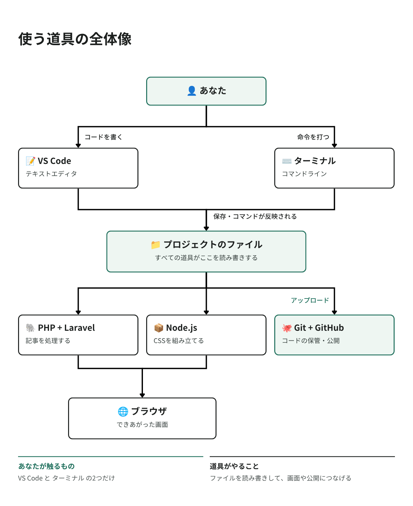

# ツールについて知ろう

ブログを作るには、いくつかの道具（ツール）が必要です。
このページでは、それぞれの道具が何をしてくれるのかを先に知っておきましょう。

インストールは次のページで行います。ここでは読むだけでOKです。

## 道具の全体像



ざっくり言うと。

- VS Code でコードを書く
- ターミナルで命令を実行する
- PHP / Laravel が記事を処理する
- Node.js が見た目のファイルを組み立てる
- ブラウザで結果を確認する
- Git / GitHub でコードを保管・公開する

## 1. テキストエディタ — Visual Studio Code

テキストエディタは、プログラムのコードを書くためのアプリです。「プログラマー用のメモ帳」だと思ってください。

今回は Visual Studio Code（VS Code、ブイエスコード）を使います。

- 無料で使える
- インストールしてすぐ使える
- 色分け表示や補完で、打ち間違いに気づきやすい
- 世界中のプログラマーに使われている

ダウンロード [https://code.visualstudio.com/](https://code.visualstudio.com/)

> メンター視点
> - 「メモ帳とどう違うの？」と聞かれたら、色分け・補完・ファイルツリーの3点を実際に見せると伝わります

## 2. ターミナル（コマンドライン）

ターミナルは、パソコンに文字で命令を出すためのアプリです。

普段はマウスでアイコンをクリックしますが、ターミナルではキーボードで命令を打ちます。
最初は黒い画面に戸惑うかもしれませんが、プログラミングには欠かせない道具です。

```
$ php artisan serve        ← あなたが打つ命令
  Server running on ...    ← パソコンからの返事
```

### ターミナルの開き方

#### macOS の場合

1. Finder →「アプリケーション」→「ユーティリティ」→「ターミナル」
2. または、Spotlight（`Cmd + Space`）で「ターミナル」と検索

#### Windows の場合

1. スタートメニューを開く
2. 「PowerShell」と検索
3. 「Windows PowerShell」をクリックして開く

> 💡 このガイドでは、Windows は PowerShell を使う前提で書いています。
> 「コマンドプロンプト」ではなく PowerShell を開いてください。

### 覚えておくと便利なコマンド

| コマンド | 意味 |
|---------|------|
| `pwd` | 今どのフォルダにいるか表示する |
| `ls` | 今のフォルダの中身を一覧表示する |
| `cd フォルダ名` | そのフォルダに移動する |
| `cd ..` | 1つ上のフォルダに戻る |
| `Ctrl + C` | 実行中の処理を止める |
| `↑` キー | 前に打ったコマンドを呼び出す |

「今どこにいるか」がとても重要です。うまくいかないときは、まず `pwd` で場所を確認しましょう。

### ⚠️ 重要な注意点

macOS用のコマンドは、Windowsでは動かないことがあります。

このガイドでは、必要な場面で macOS 用と Windows 用を分けて書いています。
ご自身のパソコンに合うほうを実行してください。

> メンター視点
> - 長いコマンドは必ずコピー＆ペーストを案内してください（打ち間違いによるエラーが最も多いです）
> - ペーストは macOS が `Cmd + V`、Windows PowerShell は `Ctrl + V` または右クリックです
> - 「ターミナルで変なコマンドを打っても、パソコンは壊れない」と最初に伝えると、心理的なハードルが下がります

## 3. Webブラウザ

作ったブログを表示して確認するために使います。

以下のいずれかを使ってください。

- Google Chrome（推奨）
- Microsoft Edge
- Firefox
- Safari

Chrome を推奨する理由…開発者向けの機能（画面の中身を調べる、エラーを確認する）が充実しているためです。

## 4. アプリを動かすための道具

ここからは、インストールしてもアイコンが出てこない道具です。ターミナルから使います。

| 道具 | 何をするもの？ |
|------|--------------|
| PHP | プログラミング言語。Laravel はこの言語で書かれています |
| Composer | PHP の部品（ライブラリ）をダウンロードしてくる係。Laravel 自体もこれで入れます |
| Laravel | Webアプリを作るための部品セット（フレームワーク） |
| SQLite | 小さなデータベース。ファイル1つに記事が保存されます。設定がほぼ不要で初心者向け |
| Node.js | JavaScript を動かす環境。CSS や JavaScript を組み立てるときに使います |
| npm | Node.js の部品をダウンロードしてくる係（Node.js に付いてきます） |
| Vite（ヴィート） | CSS / JavaScript を、ブラウザ用にまとめてくれるツール |
| Tailwind CSS | 見た目を整えるための CSS の道具。05 で使います |
| Git / GitHub | コードの変更履歴を管理し、インターネット上に保管する。06 で使います |

### 「Composer」と「npm」って何が違うの？

やっていることは同じ「部品のダウンロード係」です。扱う言語が違うだけです。

| | 対象の言語 | よく使うコマンド |
|---|-----------|----------------|
| Composer | PHP | `composer install` |
| npm | JavaScript | `npm install` |

> メンター視点
> - 「なぜ2つも必要なの？」は非常によくある質問です。「サーバー側（PHP）と、ブラウザ側（JavaScript）は別世界だから」と説明すると納得しやすいです

### 「データベース」って何？

データを整理して保存しておく場所です。Excel の表をイメージすると分かりやすいです。

| id | title（タイトル） | published_on（公開日） | body（本文） |
|----|------------------|----------------------|-------------|
| 1 | 初めての記事 | 2026-09-05 | 今日はハンズオンに参加しました… |
| 2 | 札幌の秋 | 2026-09-12 | 大通公園でイベントが… |

1行が1記事、1列が1つの項目です。

今回使う SQLite は、この表をファイル1つ（`database/database.sqlite`）に保存してくれるデータベースです。
インストールも設定もほぼ不要なので、最初の1本にはぴったりです。

## 5. 公開に使うもの

最後に、作ったブログをインターネットに公開します。

| 道具 | 何をするもの？ |
|------|--------------|
| Git（ギット） | コードの変更履歴を記録する道具 |
| GitHub（ギットハブ） | Git で管理したコードをインターネット上に保管するサービス |
| Render（レンダー） | 公開先（ホスティング）サービス。GitHub と繋ぐと自動で公開してくれます |

詳しくは 06・07 で説明します。今は「そういう流れなんだ」で大丈夫です。

## 使うバージョン

このガイドは以下のバージョンを前提にしています。

| ツール | バージョン | 備考 |
|--------|-----------|------|
| PHP | 8.5 | Laravel 13 は 8.3 以上が必要 |
| Laravel | 13.x | 2026年3月リリース |
| SQLite | 3 | PHP に最初から含まれています |
| Node.js | 24 (LTS) | LTS = 長期サポート版 |
| Tailwind CSS | v4 | v3 とは書き方が違います |
| Vite | 8 | |

> ⚠️ ネットの古い記事に注意
> 検索すると Laravel 10 / 11 / 12 の記事がたくさん出てきます。バージョンが違うと書き方が変わっていることがあるので、
> 記事を参考にするときは Laravel 13 向けかを確認してください。
> 公式ドキュメント（日本語）: [https://readouble.com/laravel/13.x/ja/](https://readouble.com/laravel/13.x/ja/)

## まとめ

| ツール | 用途 | 見た目 |
|--------|------|--------|
| Visual Studio Code | コードを書く | アプリのアイコンがある |
| ターミナル / PowerShell | コマンドを実行する | アプリのアイコンがある |
| Webブラウザ | ブログを表示する | アプリのアイコンがある |
| PHP / Composer / Laravel | アプリの中身を動かす | アイコンなし。ターミナルから使う |
| Node.js / npm | 見た目のファイルを組み立てる | アイコンなし。ターミナルから使う |
| Git | コードの履歴を管理する | アイコンなし。ターミナルから使う |

ヒント

- ターミナルで間違ったコマンドを入力しても、パソコンが壊れることはありません
- 最初はターミナルに慣れなくて当たり前です。使っているうちに慣れます
- わからないことがあったら、メンターに質問しましょう

---

次のガイド: [インストール・レシピ](./03.md)
