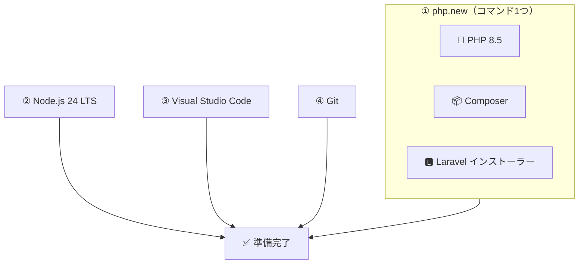

# インストール・レシピ

ブログを作る準備として、必要な道具をパソコンにインストールしましょう。

## 作業時間の目安

- **実際の手を動かす時間** 約10分
- **インストールの待ち時間** 30〜60分

インストール中は待つだけです。焦らず進めましょう。

## 重要なお知らせ

インストールの手順は、**あまり細かく理解しようとしなくて大丈夫**です。
今は「ブログを作る準備」と考えてください。使っていくうちに、それぞれの道具の役割が分かってきます。

⚠️ もしエラーが出たら、**すぐにメンターに相談してください**。
環境構築は初心者にとって最も難しい部分です。プロでも詰まります。

## 何をインストールするの？

4つだけです。



| # | インストールするもの | 方法 |
|---|-------------------|------|
| ① | PHP + Composer + Laravel インストーラー | ターミナルでコマンド1つ（`php.new`） |
| ② | Node.js 24 (LTS) | 公式サイトからインストーラーをダウンロード |
| ③ | Visual Studio Code | 公式サイトからダウンロード |
| ④ | Git | OSごとに手順が違います |

> 💡 **①は Laravel 公式が用意している方法です。** macOS でも Windows でも、
> **同じ1コマンド**で PHP・Composer・Laravel インストーラーがまとめて入ります。

---

# ① PHP + Composer + Laravel インストーラー

## macOS の場合

ターミナルを開いて、以下のコマンドを**コピー＆ペースト**して Enter を押してください。

```bash
/bin/bash -c "$(curl -fsSL https://php.new/install/mac/8.5)"
```

パスワードを求められたら、macOS のログインパスワードを入力してください。

> **メンター視点**
> - パスワードは画面に表示されません（`*` すら出ません）。これはセキュリティ上の仕様です
> - 「入力できていないように見えるが、ちゃんと入力されている」と伝えると安心されます
> - 間違えても再度聞かれるだけなので、焦らなくて大丈夫です
> - ターミナルでのペーストは `Cmd + V` です

## Windows の場合

1. スタートメニューで「PowerShell」と検索
2. 「Windows PowerShell」を**右クリック**→「**管理者として実行**」を選択
3. 以下のコマンドを**コピー＆ペースト**して Enter

```powershell
Set-ExecutionPolicy Bypass -Scope Process -Force; [System.Net.ServicePointManager]::SecurityProtocol = [System.Net.ServicePointManager]::SecurityProtocol -bor 3072; iex ((New-Object System.Net.WebClient).DownloadString('https://php.new/install/windows/8.5'))
```

> ⚠️ **必ず「管理者として実行」で開いてください。** 普通に開くと失敗します。

> **メンター視点**
> - PowerShell のペーストは `Ctrl + V` または右クリックです
> - 「管理者として実行」を忘れて失敗するケースが最も多いです。画面を一緒に見て確認してあげてください

## インストール後：ターミナルを開き直す

**インストールが終わったら、ターミナル（PowerShell）を一度すべて閉じて、新しく開き直してください。**

これをしないと、次の確認コマンドが動きません。

> **メンター視点**
> - 「新しく開き直す」を強調してください。ここを飛ばして「コマンドが見つかりません」になる人が続出します
> - 理由は「PATH（コマンドの置き場所リスト）の変更が、新しいターミナルにしか反映されないから」ですが、初学者には「開き直せば直る」だけ伝えれば十分です

## 確認

新しいターミナルで、以下を1つずつ実行してください。

```bash
php --version
```

`PHP 8.5.x` と表示されればOKです。

```bash
composer --version
```

`Composer version 2.x.x` と表示されればOKです。

```bash
laravel --version
```

`Laravel Installer 5.x.x` のように表示されればOKです。

> **メンター視点**
> - 細かいバージョン番号（`8.5.9` など）が違っても問題ありません
> - PHP が **8.3 以上** であれば Laravel 13 は動きます

---

# ② Node.js のインストール

CSS を組み立てるために使います。

## macOS / Windows 共通

1. [https://nodejs.org/](https://nodejs.org/) にアクセス
2. **「LTS」** と書かれたボタンをダウンロード（`24.x.x LTS` のはずです）
3. ダウンロードしたインストーラーを実行
4. **すべてデフォルト設定のまま**「次へ」で進める

> 💡 **LTS とは？**
> Long Term Support（長期サポート版）の略です。安定していて、長くサポートされるバージョンです。
> 隣に「Current」という新しいバージョンもありますが、**LTS を選んでください**。

> **Windows の方へ** インストール中、以下にチェックが入っていることを確認してください。
> - 「npm package manager」
> - 「Add to PATH」
>
> （通常は最初からチェックが入っています）

## 確認

ターミナルを**新しく開いて**、以下を実行します。

```bash
node --version
```

```bash
npm --version
```

両方でバージョン番号が表示されればOKです（`v24.x.x` と `11.x.x` のような表示）。

---

# ③ Visual Studio Code のインストール

コードを書くためのエディタです。

## macOS

1. [https://code.visualstudio.com/](https://code.visualstudio.com/) にアクセス
2. 「Download for Mac」をクリック
3. ダウンロードしたファイルを開いて、**「アプリケーション」フォルダにドラッグ**

## Windows

1. [https://code.visualstudio.com/](https://code.visualstudio.com/) にアクセス
2. 「Download for Windows」をクリック
3. ダウンロードしたファイルを実行してインストール
4. **「PATH への追加」にチェックが入っていることを確認**（通常は最初から入っています）

## おすすめ拡張機能（任意）

VS Code の左側にある四角いアイコン（拡張機能）から、以下を検索してインストールすると便利です。

| 拡張機能 | 何をしてくれる？ |
|---------|---------------|
| **Laravel** （publisher: Laravel） | Laravel のコードを書きやすくする公式拡張 |
| **Japanese Language Pack** | VS Code のメニューを日本語にする |

> **メンター視点**
> - 拡張機能は必須ではありません。時間が押している場合は飛ばして構いません
> - 日本語化は初学者の安心感に大きく効くので、時間があれば入れてあげてください

---

# ④ Git のインストール

06 でコードを GitHub にアップロードするときに使います。

## まず確認

ターミナルで以下を実行してください。

```bash
git --version
```

`git version 2.x.x` と表示されたら、**すでに入っているのでインストール不要**です。次に進んでください。

## macOS（表示されなかった場合）

`git --version` を実行すると、「コマンドラインデベロッパツールをインストールしますか？」というダイアログが出ることがあります。
出たら「**インストール**」をクリックしてください。数分で完了します。

ダイアログが出ない場合は、以下を実行してください。

```bash
xcode-select --install
```

## Windows（表示されなかった場合）

1. [https://git-scm.com/download/win](https://git-scm.com/download/win) にアクセス
2. ダウンロードされたインストーラーを実行
3. **すべてデフォルト設定のまま**進める（選択肢が多いですが、変更不要です）

インストール後、PowerShell を**新しく開いて** `git --version` で確認します。

---

# ✅ インストール完了チェック

ターミナルを新しく開いて、以下の4つがすべて表示されればOKです。

```bash
php --version
composer --version
node --version
git --version
```

| コマンド | 期待する表示 |
|---------|------------|
| `php --version` | `PHP 8.5.x`（8.3以上ならOK） |
| `composer --version` | `Composer version 2.x.x` |
| `node --version` | `v24.x.x` |
| `git --version` | `git version 2.x.x` |

**すべて表示されたら、準備完了です！**

> **メンター視点**
> - この4つのチェックは必ず一緒に行ってください。ここで確認漏れがあると 04 で必ず詰まります
> - スクリーンショットを撮ってもらうと、後で状況を確認しやすいです

---

# よくあるエラーと対処法

### 「コマンドが見つかりません」「'php' は認識されていません」

**原因** ターミナル（PowerShell）を開き直していない

**解決方法** ターミナルを**完全に閉じて、新しく開き直してください**

インストール時の設定変更は、**新しく開いたターミナルにしか反映されません**。
これが原因のことが圧倒的に多いです。

### PowerShell で「スクリプトの実行が無効になっている」と出る（Windows）

**原因** PowerShell の安全設定がスクリプトをブロックしています

**解決方法**

1. PowerShell を**管理者として実行**（右クリック →「管理者として実行」）
2. 以下を実行

```powershell
Set-ExecutionPolicy RemoteSigned -Scope CurrentUser
```

3. 「Y」を入力して Enter
4. PowerShell を閉じて、開き直す

> **メンター視点**
> - この設定はセキュリティレベルを少し緩めるものですが、開発では一般的な設定です
> - 不安がある方には「自分のパソコンでスクリプトを実行できるようにする設定」と説明してください

### インストールの途中で止まっているように見える

**多くの場合、止まっていません。** ダウンロード中は表示が変わらないことがあります。

**5分以上まったく変化がない**場合のみ、メンターに相談してください。

### macOS で「開発元が未確認のため開けません」と出る

**解決方法**

1. 「システム設定」→「プライバシーとセキュリティ」を開く
2. 下のほうにある「このまま開く」をクリック

### どうしてもうまくいかない場合

**遠慮なくメンターに相談してください！**

環境構築は初心者にとって最も難しい部分の一つです。
プロのエンジニアでも、環境構築で半日溶かすことがあります。あなたのせいではありません。

> **メンター視点**
> - php.new がどうしても通らない場合の代替手段
>   - macOS: [Laravel Herd](https://herd.laravel.com/)（GUIアプリ。ドラッグ&ドロップでインストール完了）
>   - Windows: [Laravel Herd for Windows](https://herd.laravel.com/windows)
> - Herd を使えば PHP / Composer / Laravel / Node がすべて GUI で入ります。当日詰まったら切り替えてください

---

## 次のステップ

準備が整いました。いよいよブログ作りを始めましょう！

**ヒント**

- インストールには時間がかかります。焦らず待ちましょう
- エラーメッセージが出たら、スクリーンショットを撮ってメンターに見せましょう
- 4つのバージョン確認ができたら、準備完了です

---

次のガイド: [ブログを作ろう](./04.md)
