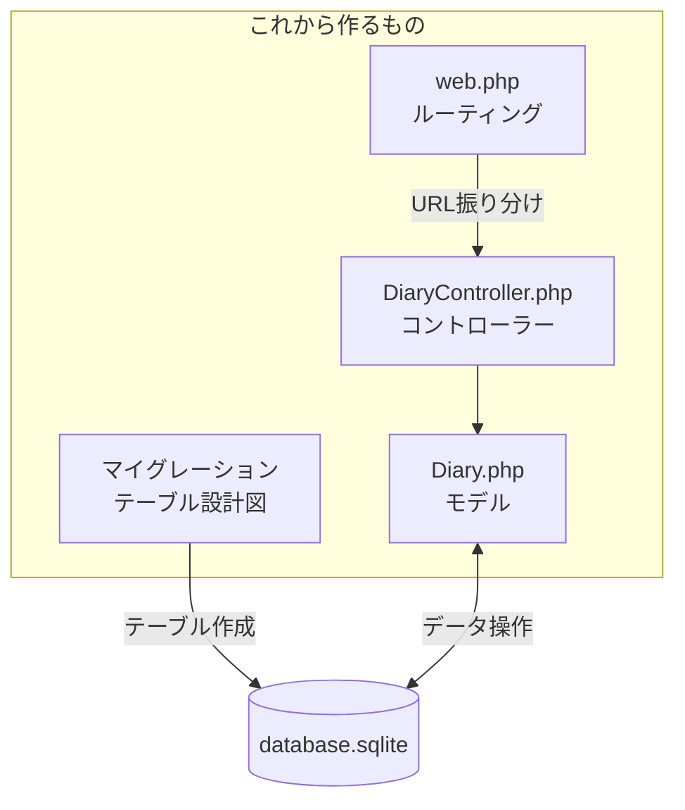
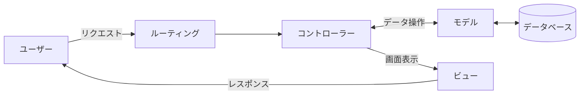

# 日記アプリを作ろう

いよいよアプリを作り始めます！このページでは、実際に動く日記アプリケーションを作成します。

## 作業時間の目安

約60〜90分

## Step 1 プロジェクトの作成

### 1-1. プロジェクト用のフォルダに移動

ターミナルを開いて、プロジェクトを作りたい場所に移動しましょう。

例えば、デスクトップに作る場合

**macOS**
```bash
cd ~/Desktop
```

**Windows**
```powershell
cd $HOME\Desktop
```

### 1-2. Laravelプロジェクトを作成

以下のコマンドを実行します。

```bash
composer create-project laravel/laravel diary-app
```

**メンターより** Composerが何をしているか説明しましょう。パッケージ管理ツールとして、Laravelとその依存関係をダウンロードしています。

> **メンター視点**
> - ダウンロードに時間がかかる場合があります（ネットワーク環境によっては5分以上）
> - 待ち時間を利用して、次のステップの説明やLaravelの概要を話すと良いでしょう
> - 進捗バーが動いていれば正常です。止まっているように見えても少し待ってみてください

しばらく待つと、`diary-app` フォルダが作成されます。

### 1-3. 作成されたフォルダに移動

```bash
cd diary-app
```

### 1-4. フォルダの中身を確認

```bash
ls
```

たくさんのファイルやフォルダが表示されます。これらは全てLaravelが用意してくれたものです。

### 1-5. Visual Studio Codeでプロジェクトを開く

```bash
code .
```

VS Codeでプロジェクトが開きます。左側のサイドバーにファイルツリーが表示されます。

> **メンター視点**
> - `code .` が動かない場合は、VS Codeを手動で開いて「ファイル」→「フォルダを開く」から `diary-app` フォルダを選択してもOKです
> - macOSで `code` コマンドが使えない場合は、VS Codeで `Cmd + Shift + P` →「shell command」と入力→「Shell Command: Install 'code' command in PATH」を実行してください

## Step 2 開発サーバーを起動

### 2-1. 必要なパッケージをインストール

```bash
npm install
```

### 2-2. サーバーを起動

```bash
php artisan serve
```

以下のようなメッセージが表示されます。

```
INFO  Server running on [http://127.0.0.1:8000]
```

**メンターより** `php artisan serve` は、開発用のWebサーバーを起動するコマンドです。このサーバーがあることで、ブラウザでアプリを確認できます。

### 2-3. ブラウザで確認

ブラウザを開いて、`http://localhost:8000` にアクセスしてください。

Laravelのウェルカムページが表示されれば成功です！

**ヒント** サーバーを止めるには、ターミナルで `Ctrl+C` を押します。

> **メンター視点**
> - サーバーを起動したターミナルは、そのまま動かし続ける必要があります
> - 以降の作業は **新しいターミナルウィンドウを開いて** 行います
> - 新しいターミナルを開いたら、`cd ~/Desktop/diary-app`（または作成した場所）で移動してから作業を続けてください
> - VS Code内のターミナル（`Ctrl + `` または `Cmd + ``）を使うと便利です

## Step 3 データベースの設定

日記を保存するためのデータベースを設定します。

### 3-1. データベースファイルを作成

**macOS**
```bash
touch database/database.sqlite
```

**Windows (PowerShell)**
```powershell
New-Item database/database.sqlite
```

または、VS Codeで `database` フォルダを右クリック → 「新しいファイル」→ `database.sqlite` と入力して作成できます。

### 3-2. 設定を確認

VS Codeで `.env` ファイルを開きます。

> **メンター視点**
> - `.env` はドット（.）から始まる「隠しファイル」です
> - VS Codeのサイドバーには表示されますが、Finderやエクスプローラーでは見えない場合があります
> - ファイルが見つからない場合は、VS Codeのサイドバーで `diary-app` フォルダ直下を確認してください

以下のような行があることを確認してください。

```
DB_CONNECTION=sqlite
```

**メンターより** `.env` ファイルは、アプリの設定を管理するファイルです。データベースの種類や接続情報などを記載します。

## Step 4 日記のモデルを作成

これから作成するファイルの関係を確認しておきましょう。



### 4-1. モデルとマイグレーションを生成

ターミナルで以下を実行。

```bash
php artisan make:model Diary -m
```

実行すると、2つのファイルが作成されます。

- `app/Models/Diary.php` - 日記のモデル
- `database/migrations/xxxx_create_diaries_table.php` - データベーステーブルの設計図

**メンターより** モデルは、データベースとやり取りするためのクラスです。Laravelでは、モデルを使ってデータの保存や取得を簡単に行えます。

### 4-2. マイグレーションファイルを編集

VS Codeで `database/migrations/` フォルダの中から、`xxxx_create_diaries_table.php` というファイルを開きます。

> **メンター視点**
> - `xxxx` の部分は作成日時（例：`2024_01_15_123456`）によって異なります
> - フォルダ内で一番新しい日付、または `diaries` という名前を含むファイルを探してください
> - 既存のマイグレーションファイル（`create_users_table` など）とは別のファイルです

`up()` メソッドの中を以下のように編集します。

```php
public function up(): void
{
    Schema::create('diaries', function (Blueprint $table) {
        $table->id();
        $table->date('date');          // 追加
        $table->text('content');       // 追加
        $table->timestamps();
    });
}
```

**メンターより** マイグレーションは、データベースのテーブル構造を定義します。ここでは日記の日付（date）と内容（content）を保存できるようにしています。

### 4-3. モデルを編集

`app/Models/Diary.php` を開いて、以下のように編集します。

> **メンター視点**
> - このファイルは **全体を置き換え** ます。元の内容を全て削除してから、下のコードを貼り付けてください
> - `Cmd + A`（macOS）または `Ctrl + A`（Windows）で全選択してから貼り付けると簡単です

```php
<?php

namespace App\Models;

use Illuminate\Database\Eloquent\Model;

class Diary extends Model
{
    protected $fillable = [
        'date',
        'content',
    ];

    protected $casts = [
        'date' => 'date',
    ];
}
```

**メンターより** `$fillable` は、一括代入を許可するフィールドを指定します。セキュリティのために、明示的に指定する必要があります。

### 4-4. マイグレーションを実行

```bash
php artisan migrate
```

成功すると、以下のようなメッセージが表示されます。

```
INFO  Running migrations.
```

これで、データベースにテーブルが作成されました！

## Step 5 コントローラーを作成

日記の操作（作成、表示、編集、削除）を管理するコントローラーを作ります。

ここで、Laravelの全体像を理解しておきましょう。Laravelは **MVC（Model-View-Controller）パターン** を採用しています。



> **メンター視点**
> - MVCは「役割分担」と説明すると分かりやすいです
> - Model = データ担当、View = 見た目担当、Controller = 司令塔
> - 「レストランに例えると、Model=キッチン、View=料理の盛り付け、Controller=ウェイター」のような例えも有効です

### 5-1. コントローラーを生成

```bash
php artisan make:controller DiaryController --resource
```

`app/Http/Controllers/DiaryController.php` が作成されます。

### 5-2. コントローラーを編集

作成されたファイルを開いて、以下の内容に置き換えます。

> **メンター視点**
> - コードが長いですが、一度に全て理解する必要はありません
> - 「こういう処理をしている」という概要を伝えれば十分です
> - 各メソッドの役割：`index`=一覧、`create`=新規画面、`store`=保存、`edit`=編集画面、`update`=更新、`destroy`=削除
> - コードは全体を置き換えます。`Cmd + A` / `Ctrl + A` で全選択してから貼り付けてください

```php
<?php

namespace App\Http\Controllers;

use App\Models\Diary;
use Illuminate\Http\Request;

class DiaryController extends Controller
{
    // 一覧表示
    public function index(Request $request)
    {
        $month = $request->query('month', now()->format('Y-m'));

        $diaries = Diary::whereYear('date', substr($month, 0, 4))
            ->whereMonth('date', substr($month, 5, 2))
            ->orderBy('date', 'desc')
            ->get();

        // 月選択用のオプション（過去12ヶ月）
        $months = [];
        for ($i = 0; $i < 12; $i++) {
            $date = now()->subMonths($i);
            $months[$date->format('Y-m')] = $date->format('Y年n月');
        }

        return view('diaries.index', compact('diaries', 'months', 'month'));
    }

    // 新規作成画面
    public function create()
    {
        return view('diaries.create');
    }

    // 保存
    public function store(Request $request)
    {
        $validated = $request->validate([
            'date' => 'required|date',
            'content' => 'required|string',
        ]);

        Diary::create($validated);

        return redirect()->route('diaries.index')
            ->with('success', '日記を保存しました');
    }

    // 編集画面
    public function edit(Diary $diary)
    {
        return view('diaries.edit', compact('diary'));
    }

    // 更新
    public function update(Request $request, Diary $diary)
    {
        $validated = $request->validate([
            'date' => 'required|date',
            'content' => 'required|string',
        ]);

        $diary->update($validated);

        return redirect()->route('diaries.index')
            ->with('success', '日記を更新しました');
    }

    // 削除
    public function destroy(Diary $diary)
    {
        $diary->delete();

        return redirect()->route('diaries.index')
            ->with('success', '日記を削除しました');
    }
}
```

**メンターより** コントローラーは、ユーザーからのリクエストを受け取り、モデルとビューを仲介する役割を持ちます。MVCパターンの「C」に相当します。

## Step 6 ルーティングの設定

アプリのURLとコントローラーを紐付けます。

`routes/web.php` を開いて、以下のように編集します。

> **メンター視点**
> - 元々書いてあった内容（`Route::get('/', function () { ... });` など）は **全て削除** して、下のコードに置き換えてください
> - ルーティングは「このURLにアクセスしたら、このコントローラーのこのメソッドを呼ぶ」という対応表です

```php
<?php

use App\Http\Controllers\DiaryController;
use Illuminate\Support\Facades\Route;

Route::get('/', [DiaryController::class, 'index'])->name('diaries.index');
Route::get('/diaries/create', [DiaryController::class, 'create'])->name('diaries.create');
Route::post('/diaries', [DiaryController::class, 'store'])->name('diaries.store');
Route::get('/diaries/{diary}/edit', [DiaryController::class, 'edit'])->name('diaries.edit');
Route::put('/diaries/{diary}', [DiaryController::class, 'update'])->name('diaries.update');
Route::delete('/diaries/{diary}', [DiaryController::class, 'destroy'])->name('diaries.destroy');
```

**メンターより** ルーティングは、URLとコントローラーのアクションを結びつけます。これにより、ユーザーが特定のURLにアクセスしたときに、どのコントローラーのどのメソッドを実行するかが決まります。

## 次のステップ

コントローラーとルーティングができました。次は「HTMLとCSSでデザインしよう」のページで、画面を作っていきます！

ここまでで、アプリの基礎部分（モデル、コントローラー、ルーティング）が完成しました。

**トラブルシューティング**

- **マイグレーションでエラーが出る** `database/database.sqlite` ファイルが作成されているか確認してください
- **コマンドが見つからない** ターミナルで `diary-app` フォルダにいるか確認してください（`pwd` コマンドで確認）
- **サーバーが起動しない** 既に他のサーバーが動いていないか確認してください
