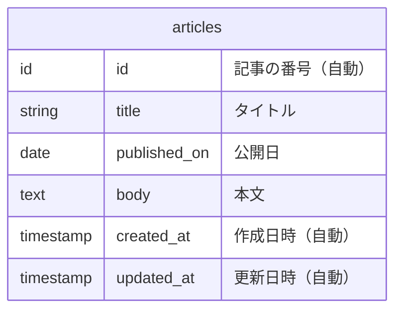
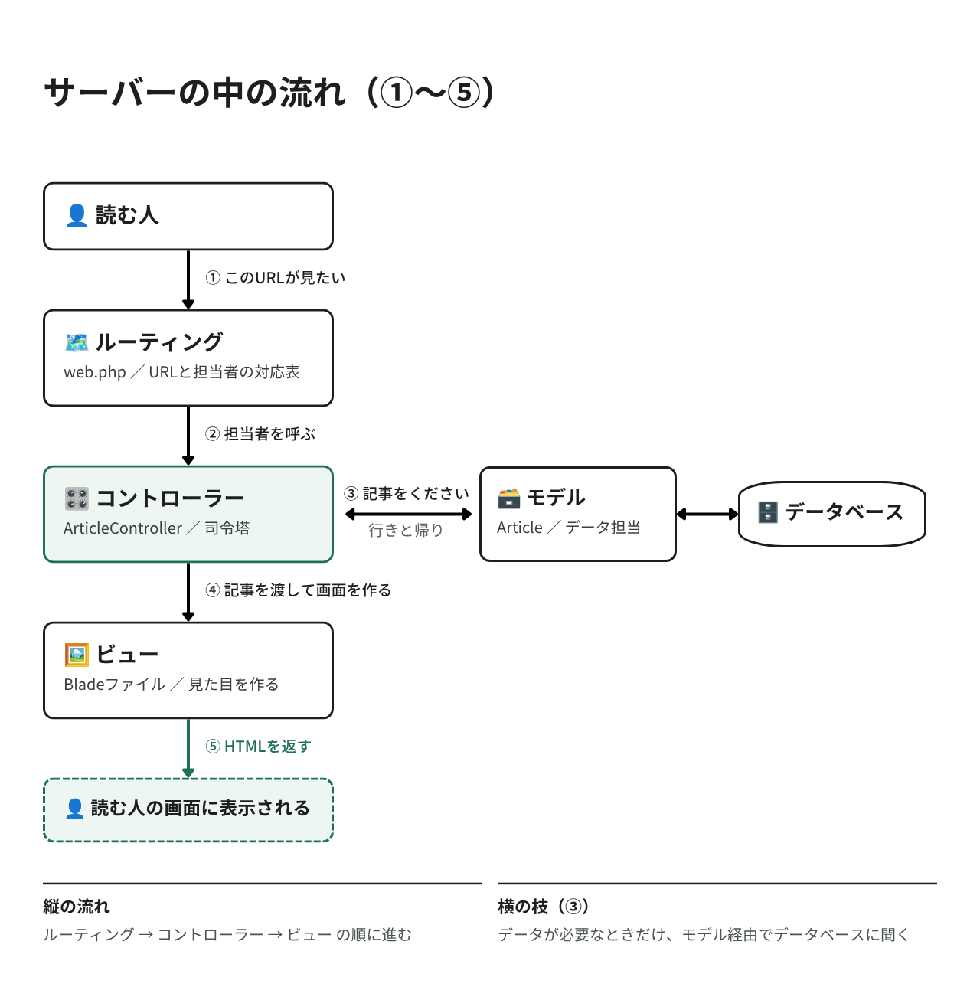

# ブログを作ろう

いよいよブログを作り始めます！
このページでは、アプリの「中身」（記事を保存したり取り出したりする仕組み）を作ります。

見た目（HTML / CSS）は次のページで作るので、このページの最後ではまだ画面は出ません。安心して進めてください。

## 作業時間の目安

約60〜90分

## このページのゴール

このページが終わると、以下の4つができあがります。

| 作るもの | 何をするもの |
|---|---|
| マイグレーション | 記事を保存する表の設計図 |
| モデル | 記事1件を表すクラス |
| コントローラー | 記事の処理をまとめた司令塔 |
| ルーティング | URLと処理の対応表 |

4つがどう連携するのかは、Step 5 で説明します。

---

## Step 1 プロジェクトを作る

### 1-1. プロジェクトを置く場所に移動

ターミナルを開いて、プロジェクトを作りたい場所に移動します。
ここではデスクトップに作ります。

#### macOS

```bash
cd ~/Desktop
```

#### Windows

```powershell
cd $HOME\Desktop
```

### 1-2. Laravel プロジェクトを作成

以下のコマンドを実行します。

```bash
laravel new blog-app
```

すると、いくつか質問されます。以下のとおりに答えてください。

| # | 質問（英語） | 意味 | 答え |
|---|------------|------|------|
| 1 | `Do you want to use a starter kit?` | スターターキットを使う？ | No（`n` を押して Enter） |
| 2 | `Which frontend stack do you want to build on?` | 画面の作り方は？ | Blade（そのまま Enter） |
| 3 | `Which testing framework do you prefer?` | テストの道具は？ | Pest（そのまま Enter） |
| 4 | `Do you want to install Laravel Boost...?` | AI補助ツールを入れる？ | No（`n` を押して Enter） |
| 5 | `Would you like to run npm install and npm run build?` | 見た目の部品も入れる？ | Yes（`y` を押して Enter） |

> 💡 選択肢は矢印キー（↑↓）で選んで Enter です。マウスは使えません。
> `Yes/No` の質問は `y` または `n` を押してから Enter です。

> メンター視点
> - 質問が英語で並ぶので、ここは画面を一緒に見ながら進めてください
> - 1問目で「Yes」を選ぶと、ログイン機能つきの複雑なプロジェクトが作られてしまいます。必ず No です
> - 2問目の Blade は「今回はシンプルな作り方でいく」という意味だと伝えれば十分です
> - ダウンロードに5分以上かかることがあります。待ち時間に Laravel の概要や MVC の説明をすると効果的です

しばらく待つと、`blog-app` フォルダが作られます。

> うまくいかないとき
> `laravel` コマンドが見つからない場合は、代わりに以下でも作れます（質問は出ません）。
> ```bash
> composer create-project laravel/laravel blog-app
> ```
> この場合は、あとで `blog-app` フォルダの中で `npm install` と `npm run build` を実行してください。

### 1-3. 作られたフォルダに移動

```bash
cd blog-app
```

これ以降のコマンドは、すべてこの `blog-app` フォルダの中で実行します。

> 💡 迷子になったら `pwd` で今いる場所を確認しましょう。
> 末尾が `blog-app` になっていればOKです。

### 1-4. VS Code でプロジェクトを開く

```bash
code .
```

VS Code が開き、左側にファイル一覧（ファイルツリー）が表示されます。

> メンター視点
> - `code .` が動かない場合は、VS Code を手動で開いて「ファイル」→「フォルダを開く」から `blog-app` を選んでもOKです
> - macOS で `code` が使えない場合は、VS Code で `Cmd + Shift + P` →「shell command」と入力 →「Shell Command: Install 'code' command in PATH」を実行してください

### 1-5. フォルダの中身をながめてみる

たくさんのファイルがありますが、今回さわるのは以下だけです。

```
blog-app/
├── app/
│   ├── Http/Controllers/   ← 処理の司令塔を置く場所
│   └── Models/             ← データを表すクラスを置く場所
├── database/
│   ├── migrations/         ← 表の設計図を置く場所
│   └── database.sqlite     ← 記事が保存されるファイル
├── resources/
│   ├── css/app.css         ← CSS（05で使います）
│   └── views/              ← 画面のHTML（05で使います）
├── routes/
│   └── web.php             ← URLの振り分け表
└── .env                    ← 設定ファイル
```

> メンター視点
> - 「こんなにファイルがあるの…」と圧倒される方が多いです。「99%は触らない。使うのはこの6つだけ」と最初に伝えると安心されます

---

## Step 2 開発サーバーを起動する

### 2-1. サーバーを起動

```bash
php artisan serve
```

以下のように表示されます。

```
INFO  Server running on [http://127.0.0.1:8000]
```

> 💡 `php artisan`（アルティザン）とは？
> Laravel に付いてくる便利コマンド集です。これから何度も使います。

### 2-2. ブラウザで確認

ブラウザで [http://localhost:8000](http://localhost:8000) を開いてください。

Laravel のウェルカムページが表示されれば成功です！🎉

まだ自分のブログではありませんが、サーバーが動いている証拠です。

### 2-3. これ以降の作業について

⚠️ サーバーを起動したターミナルは、開いたままにしておきます。

これ以降のコマンドは、別のターミナルを開いて実行してください。

| | ターミナル① | ターミナル② |
|---|---|---|
| 役割 | サーバーを動かし続ける | これ以降のコマンドを実行する |
| 状態 | `php artisan serve` を実行したまま。操作できません | ここで作業します |
| 開き方 | すでに開いています | VS Code のメニュー「ターミナル」→「新しいターミナル」<br>または、ターミナルを新しく開いて `cd ~/Desktop/blog-app` で移動 |
| 止め方 | `Ctrl + C` | — |

---

## Step 3 データベースを確認する

記事を保存するデータベースを確認します。今回は設定を変える必要はありません。

### 3-1. `.env` ファイルを見てみる

VS Code のファイル一覧から `.env` を開いてください。

> メンター視点
> - `.env` はドット（`.`）から始まる「隠しファイル」です
> - VS Code のファイル一覧には表示されますが、Finder / エクスプローラーでは見えないことがあります
> - `blog-app` フォルダ直下（`app` や `config` と同じ階層）にあります

以下の行があることを確認してください。

```ini
DB_CONNECTION=sqlite
```

これは「SQLite というデータベースを使う」という設定です。

### 3-2. データベースのファイルを確認

VS Code のファイル一覧で `database` フォルダを開くと、
`database.sqlite` というファイルがあります。

これが記事の保管庫です。プロジェクト作成時に自動で作られているので、何もしなくてOKです。

> 💡 `.env` って何？
> アプリの設定を書いておくファイルです。データベースの種類やパスワードなど、
> 人に見せたくない情報を入れます。
> `.env` は GitHub にアップロードされない設定になっているので、安心してください（06 で説明します）。

---

## Step 4 記事のモデルを作る

「記事」をデータベースに保存できるようにします。

### 4-1. モデルとマイグレーションを作る

ターミナル②で以下を実行します。

```bash
php artisan make:model Article -m
```

2つのファイルが作られます。

| 作られたファイル | 役割 |
|---------------|------|
| `app/Models/Article.php` | 🗃 モデル。記事1件を表すクラス |
| `database/migrations/xxxx_create_articles_table.php` | 📐 マイグレーション。表の設計図 |

> 💡 `-m` は「マイグレーションも一緒に作って」という意味です。

> メンター視点
> - `Article` は大文字始まり・単数形です。Laravel はこの名前から自動で `articles` テーブルを探します
> - この「名前の規約」が Laravel の便利さの核なので、余裕があれば触れてください

### 4-2. マイグレーション（表の設計図）を編集

`database/migrations/` フォルダの中の、`xxxx_create_articles_table.php` を開きます。

> メンター視点
> - `xxxx` の部分は作成日時（例: `2026_09_05_101530`）です。人によって違います
> - フォルダ内で一番下（一番新しい）のファイル、または名前に `articles` を含むファイルです
> - 最初から入っている `create_users_table` などとは別のファイルです

`up()` メソッドの中を、以下のように編集します。

```php
public function up(): void
{
    Schema::create('articles', function (Blueprint $table) {
        $table->id();
        $table->string('title');        // 追加：タイトル
        $table->date('published_on');   // 追加：公開日
        $table->text('body');           // 追加：本文
        $table->timestamps();
    });
}
```

この設計図は、こんな表を作る指示です。



実際に記事を保存すると、こんなふうに1行ずつ増えていきます。

| id | title | published_on | body |
|----|-------|--------------|------|
| 1 | 初めての記事 | 2026-09-05 | 今日は… |
| 2 | 札幌の秋 | 2026-09-12 | 大通公園で… |

書いたコードの意味は、それぞれこうなっています。

| 書いたコード | 何ができる？ |
|------------|------------|
| `$table->id()` | 記事の番号（1, 2, 3…）。自動でつきます |
| `$table->string('title')` | 短い文字を入れる列。タイトル用 |
| `$table->date('published_on')` | 日付を入れる列。公開日用 |
| `$table->text('body')` | 長い文章を入れる列。本文用 |
| `$table->timestamps()` | 作成日時・更新日時。自動で記録されます |

> 💡 `string` と `text` の違い
> `string` は短い文字（255文字まで）、`text` は長い文章向けです。
> タイトルは `string`、本文は `text` を使います。

### 4-3. モデルを編集

`app/Models/Article.php` を開いて、中身をすべて消してから以下を貼り付けます。

> メンター視点
> - このファイルは全体を置き換えます
> - `Cmd + A`（macOS）/ `Ctrl + A`（Windows）で全選択してから貼り付けると簡単です

```php
<?php

namespace App\Models;

use Illuminate\Database\Eloquent\Attributes\Fillable;
use Illuminate\Database\Eloquent\Model;

#[Fillable(['title', 'published_on', 'body'])]
class Article extends Model
{
    protected function casts(): array
    {
        return [
            'published_on' => 'date',
        ];
    }
}
```

| 書いたコード | 意味 |
|------------|------|
| `#[Fillable([...])]` | フォームから保存してよい項目の指定。書いていない項目は保存されません（セキュリティ対策） |
| `casts()` の `'published_on' => 'date'` | 公開日を日付として扱う指定。`2026年9月5日` のような整形ができるようになります |

> 💡 なぜ「保存してよい項目」を指定するの？
> 指定しないと、悪意のある人がフォームに勝手な項目を紛れ込ませて、
> 本来変えられないデータ（管理者フラグなど）を書き換えられてしまう可能性があるためです。

> メンター視点
> - `#[Fillable(...)]` は Laravel 12 以前の `protected $fillable = [...]` と同じ意味です
> - ネットの記事は `$fillable` 表記が多いので、「書き方が2つあるが、どちらも動く」と伝えておくと混乱が減ります

### 4-4. マイグレーションを実行（表を作る）

設計図ができたので、実際に表を作ります。

```bash
php artisan migrate
```

以下のように表示されれば成功です。

```
INFO  Running migrations.

  xxxx_create_articles_table ......................... DONE
```

これで、記事を保存する場所ができました！

4-2 で書いた設計図が、いまデータベースに反映されて、実際の `articles` テーブルになりました。

> メンター視点
> - 「設計図を書く」→「migrate で実際に作る」の2段階であることを強調してください
> - ここは初学者がもっともイメージしづらい部分です。図を描いて説明すると効果的です

---

## Step 5 コントローラーを作る

記事の処理（一覧・表示・作成・保存・編集・更新・削除）を担当する係を作ります。

### Laravel の全体像（MVC）

その前に、Laravel の仕組みを見ておきましょう。
Laravel は MVC（エムブイシー）という考え方でできています。



| 役割 | 名前 | 担当 |
|------|------|------|
| Model | モデル | データ担当。データベースとやりとりする |
| View | ビュー | 見た目担当。HTMLを作る（05で作ります） |
| Controller | コントローラー | 司令塔。M と V をつなぐ |

> メンター視点
> - レストランに例えると分かりやすいです
>   - Model = キッチン（料理を作る＝データを用意する）
>   - View = 盛り付け（見た目を整える）
>   - Controller = ウェイター（注文を聞いてキッチンに伝え、料理を客に運ぶ）
> - 「役割分担」という言葉がいちばん伝わります

### 5-1. コントローラーを作る

```bash
php artisan make:controller ArticleController --resource
```

`app/Http/Controllers/ArticleController.php` が作られます。

> 💡 `--resource` とは？
> 一覧・作成・保存・表示・編集・更新・削除というよくある7つの処理の枠を、
> 最初から用意してくれるオプションです。

### 5-2. コントローラーを編集

作られたファイルを開いて、中身をすべて消してから以下を貼り付けます。

> メンター視点
> - コードが長いですが、一度に全部理解する必要はありません
> - 「7つのメソッドが、7つの機能に対応している」ことだけ伝えれば十分です
> - `Cmd + A` / `Ctrl + A` で全選択してから貼り付けてください

```php
<?php

namespace App\Http\Controllers;

use App\Models\Article;
use Illuminate\Http\Request;

class ArticleController extends Controller
{
    // 記事一覧（月別アーカイブつき）
    public function index(Request $request)
    {
        $month = $request->query('month', now()->format('Y-m'));

        $articles = Article::whereYear('published_on', substr($month, 0, 4))
            ->whereMonth('published_on', substr($month, 5, 2))
            ->orderBy('published_on', 'desc')
            ->get();

        // 月別アーカイブの選択肢（直近12ヶ月）
        $months = [];
        for ($i = 0; $i < 12; $i++) {
            $date = now()->subMonths($i);
            $months[$date->format('Y-m')] = $date->format('Y年n月');
        }

        return view('articles.index', compact('articles', 'months', 'month'));
    }

    // 記事ページ（1件を読む）
    public function show(Article $article)
    {
        return view('articles.show', compact('article'));
    }

    // 新規作成画面
    public function create()
    {
        return view('articles.create');
    }

    // 保存
    public function store(Request $request)
    {
        $validated = $request->validate([
            'title' => 'required|string|max:255',
            'published_on' => 'required|date',
            'body' => 'required|string',
        ]);

        Article::create($validated);

        return redirect()->route('articles.index')
            ->with('success', '記事を公開しました');
    }

    // 編集画面
    public function edit(Article $article)
    {
        return view('articles.edit', compact('article'));
    }

    // 更新
    public function update(Request $request, Article $article)
    {
        $validated = $request->validate([
            'title' => 'required|string|max:255',
            'published_on' => 'required|date',
            'body' => 'required|string',
        ]);

        $article->update($validated);

        return redirect()->route('articles.show', $article)
            ->with('success', '記事を更新しました');
    }

    // 削除
    public function destroy(Article $article)
    {
        $article->delete();

        return redirect()->route('articles.index')
            ->with('success', '記事を削除しました');
    }
}
```

### 7つのメソッドの役割

| メソッド | いつ動く？ | 何をする？ |
|---------|-----------|-----------|
| `index` | 記事一覧を開いたとき | その月の記事を取り出して一覧画面へ |
| `show` | 記事をクリックしたとき | 記事1件を取り出して記事ページへ |
| `create` | 「新しい記事を書く」を押したとき | 入力フォームを表示 |
| `store` | 「公開する」を押したとき | 入力内容を保存する |
| `edit` | 「編集」を押したとき | 編集フォームを表示 |
| `update` | 編集後に「更新」を押したとき | 内容を書き換える |
| `destroy` | 「削除」を押したとき | 記事を消す |

> 💡 画面を出すだけのメソッド（`create` / `edit`）と、
> データを変えるメソッド（`store` / `update` / `destroy`）がペアになっています。

### コードのポイント

| 書いたコード | 意味 |
|------------|------|
| `$request->validate([...])` | 入力チェック。空欄なら保存せずエラーを表示します |
| `'required'` | 必須（空欄はダメ） |
| `'max:255'` | 255文字まで |
| `Article::create($validated)` | 記事を新規保存 |
| `$article->update($validated)` | 記事を書き換え |
| `$article->delete()` | 記事を削除 |
| `return view('articles.index', ...)` | `resources/views/articles/index.blade.php` を表示 |
| `redirect()->route('articles.index')` | 一覧ページに移動させる |
| `->with('success', '...')` | 「保存しました」のようなメッセージを1回だけ表示 |

> 💡 `show(Article $article)` の不思議
> URL に `/articles/3` と入ってくると、Laravel が自動で3番の記事を探して渡してくれます。
> 自分で「3番の記事を取ってくる」コードを書かなくていいのです。便利ですね。

---

## Step 6 ルーティングを設定する

どのURLで、どの処理を動かすかを決めます。

`routes/web.php` を開いて、中身をすべて消してから以下を貼り付けます。

```php
<?php

use App\Http\Controllers\ArticleController;
use Illuminate\Support\Facades\Route;

Route::get('/', [ArticleController::class, 'index'])->name('articles.index');
Route::get('/articles/create', [ArticleController::class, 'create'])->name('articles.create');
Route::post('/articles', [ArticleController::class, 'store'])->name('articles.store');
Route::get('/articles/{article}', [ArticleController::class, 'show'])->name('articles.show');
Route::get('/articles/{article}/edit', [ArticleController::class, 'edit'])->name('articles.edit');
Route::put('/articles/{article}', [ArticleController::class, 'update'])->name('articles.update');
Route::delete('/articles/{article}', [ArticleController::class, 'destroy'])->name('articles.destroy');
```

### ルーティングは「URLと処理の対応表」です

| URL | 方式 | 動くメソッド | 名前 |
|-----|------|------------|------|
| `/` | GET | `index` | `articles.index` |
| `/articles/create` | GET | `create` | `articles.create` |
| `/articles` | POST | `store` | `articles.store` |
| `/articles/3` | GET | `show` | `articles.show` |
| `/articles/3/edit` | GET | `edit` | `articles.edit` |
| `/articles/3` | PUT | `update` | `articles.update` |
| `/articles/3` | DELETE | `destroy` | `articles.destroy` |

> 💡 GET / POST / PUT / DELETE とは？
> ブラウザからサーバーへの「お願いの種類」です。
>
> | 種類 | 意味 |
> |------|------|
> | GET | 「見せて」（ページを開く） |
> | POST | 「新しく作って」 |
> | PUT | 「書き換えて」 |
> | DELETE | 「消して」 |
>
> 同じ `/articles/3` でも、GET なら表示、PUT なら更新、DELETE なら削除になります。

> ⚠️ 書く順番が大事です
> `/articles/create` は `/articles/{article}` より上に書いてください。
> 逆にすると、Laravel が `create` を「記事のID」だと勘違いしてしまいます。

> 💡 `->name(...)` は何のため？
> 画面のリンクを書くときに、URLを直接書かずに名前で指定できます。
> 後でURLを変えても、リンクを全部直さずに済みます。

---

## ✅ ここまでのチェック

ターミナル②で以下を実行してください。

```bash
php artisan route:list
```

設定したURL一覧が表示されればOKです。

```
GET|HEAD   / .................... articles.index
GET|HEAD   articles/create ...... articles.create
POST       articles ............. articles.store
GET|HEAD   articles/{article} ... articles.show
...
```

> ⚠️ ブラウザで `http://localhost:8000` を開くと、まだエラーが出ます。
> 画面（ビュー）をまだ作っていないためです。これは正常です。
> 次のページで画面を作ります。

---

## 次のステップ

ここまでで、ブログの基礎部分（モデル・マイグレーション・コントローラー・ルーティング）が完成しました。

次は「HTMLとCSSでデザインしよう」で、実際に見える画面を作っていきます！

## トラブルシューティング

| 症状 | 確認すること |
|------|------------|
| コマンドが見つからない | `pwd` で `blog-app` フォルダにいるか確認 |
| `php artisan migrate` でエラー | `database/database.sqlite` があるか確認。無ければ VS Code で `database` フォルダを右クリック →「新しいファイル」→ `database.sqlite` と入力して作成し、もう一度実行 |
| サーバーが起動しない | 別のターミナルで既に `php artisan serve` が動いていないか確認 |
| `Class "App\Models\Article" not found` | ファイル名が `Article.php`（大文字始まり・単数形）になっているか確認 |
| `no such table: articles` | `php artisan migrate` を実行したか確認 |

---

次のガイド: [HTMLとCSSでデザインしよう](./05.md)
