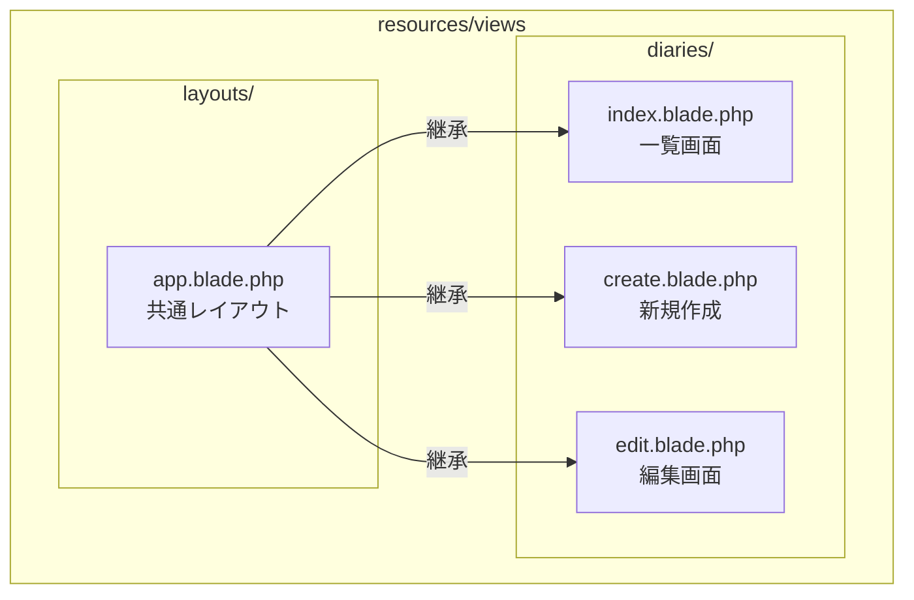
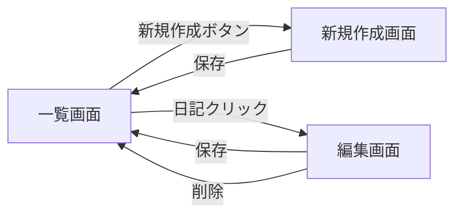

# HTMLとCSSでデザインしよう

前のページでアプリの基礎部分を作りました。このページでは、実際に画面を作って見た目を整えます。

## 作業時間の目安

約45〜60分

## Step 1 レイアウトファイルを作成

すべてのページで共通して使うレイアウトを作ります。

まず、これから作成するファイルの構成を確認しましょう。



### 1-1. フォルダを作成

VS Codeで `resources/views` の中に以下のフォルダを作成します。

- `layouts` フォルダ
- `diaries` フォルダ

> **メンター視点**
> - VS Codeでフォルダを作成する方法：`resources/views` フォルダを右クリック →「新しいフォルダ」
> - ターミナルでもVS Codeでも、どちらでも大丈夫です
> - フォルダ名のスペルミスに注意してください（`layouts`、`diaries`）

または、ターミナルで

```bash
mkdir -p resources/views/layouts
mkdir -p resources/views/diaries
```

### 1-2. レイアウトファイルを作成

`resources/views/layouts/app.blade.php` を作成して、以下の内容を書きます。

> **メンター視点**
> - ファイルの作成方法：`layouts` フォルダを右クリック →「新しいファイル」→ `app.blade.php` と入力
> - 拡張子は `.blade.php` です。`.php` だけにならないよう注意してください
> - コードは全てコピー＆ペーストで大丈夫です。手入力は不要です

```html
<!DOCTYPE html>
<html lang="ja">
<head>
    <meta charset="UTF-8">
    <meta name="viewport" content="width=device-width, initial-scale=1.0">
    <title>マイ日記</title>
    @vite(['resources/css/app.css', 'resources/js/app.js'])
</head>
<body class="bg-gray-100 min-h-screen">
    <div class="container mx-auto px-4 py-8 max-w-2xl">
        <header class="mb-8">
            <h1 class="text-3xl font-bold text-gray-800 text-center">📔 マイ日記</h1>
        </header>

        @if (session('success'))
            <div class="bg-green-100 border border-green-400 text-green-700 px-4 py-3 rounded mb-4">
                {{ session('success') }}
            </div>
        @endif

        @yield('content')
    </div>
</body>
</html>
```

**メンターより** これはBladeテンプレートです。`@yield('content')` の部分に、各ページの内容が入ります。`@if (session('success'))` は、保存や更新の成功メッセージを表示します。


## Step 2 一覧画面を作成

日記の一覧を表示する画面を作ります。

### 2-1. index.blade.phpを作成

`resources/views/diaries/index.blade.php` を作成します。

> **メンター視点**
> - Step 2〜4 では同じ要領でファイルを作成していきます
> - コードは全てコピー＆ペーストでOKです。写経する必要はありません
> - ファイル名を間違えると動かないので、スペルに注意してください

```html
@extends('layouts.app')

@section('content')
    <div class="mb-6 flex justify-between items-center">
        <form method="GET" action="{{ route('diaries.index') }}" class="flex items-center gap-2">
            <select name="month" onchange="this.form.submit()" class="rounded border-gray-300 shadow-sm focus:border-blue-500 focus:ring-blue-500">
                @foreach ($months as $value => $label)
                    <option value="{{ $value }}" {{ $month === $value ? 'selected' : '' }}>
                        {{ $label }}
                    </option>
                @endforeach
            </select>
        </form>

        <a href="{{ route('diaries.create') }}" class="bg-blue-500 hover:bg-blue-600 text-white px-4 py-2 rounded shadow">
            + 新規作成
        </a>
    </div>

    @if ($diaries->isEmpty())
        <div class="text-center text-gray-500 py-8">
            この月の日記はありません
        </div>
    @else
        <div class="space-y-4">
            @foreach ($diaries as $diary)
                <a href="{{ route('diaries.edit', $diary) }}" class="block bg-white rounded-lg shadow p-4 hover:shadow-md transition-shadow">
                    <div class="text-sm text-gray-500 mb-2">
                        {{ $diary->date->format('n月j日') }}
                    </div>
                    <div class="text-gray-700">
                        {{ Str::limit($diary->content, 100) }}
                    </div>
                </a>
            @endforeach
        </div>
    @endif
@endsection
```

**メンターより** 
- `@extends('layouts.app')` で、先ほど作ったレイアウトを使います
- `@foreach` でループ処理を行い、日記の一覧を表示します
- `{{ }}` の中にPHPの変数や式を書けます


## Step 3 新規作成画面を作成

`resources/views/diaries/create.blade.php` を作成します。

```html
@extends('layouts.app')

@section('content')
    <div class="bg-white rounded-lg shadow p-6">
        <h2 class="text-xl font-semibold mb-4">日記を書く</h2>

        <form method="POST" action="{{ route('diaries.store') }}">
            @csrf

            <div class="mb-4">
                <label for="date" class="block text-sm font-medium text-gray-700 mb-1">日付</label>
                <input type="date" name="date" id="date" value="{{ old('date', date('Y-m-d')) }}"
                    class="w-full rounded border-gray-300 shadow-sm focus:border-blue-500 focus:ring-blue-500">
                @error('date')
                    <p class="text-red-500 text-sm mt-1">{{ $message }}</p>
                @enderror
            </div>

            <div class="mb-6">
                <label for="content" class="block text-sm font-medium text-gray-700 mb-1">内容</label>
                <textarea name="content" id="content" rows="8"
                    class="w-full rounded border-gray-300 shadow-sm focus:border-blue-500 focus:ring-blue-500">{{ old('content') }}</textarea>
                @error('content')
                    <p class="text-red-500 text-sm mt-1">{{ $message }}</p>
                @enderror
            </div>

            <div class="flex justify-between">
                <a href="{{ route('diaries.index') }}" class="text-gray-600 hover:text-gray-800">
                    ← 戻る
                </a>
                <button type="submit" class="bg-blue-500 hover:bg-blue-600 text-white px-6 py-2 rounded shadow">
                    保存
                </button>
            </div>
        </form>
    </div>
@endsection
```

**メンターより**
- `@csrf` は、クロスサイトリクエストフォージェリという攻撃を防ぐためのトークンです。Laravelではフォームに必須です
- `@error` でバリデーションエラーを表示できます
- `old('date')` は、エラー時に入力内容を保持します


## Step 4 編集画面を作成

`resources/views/diaries/edit.blade.php` を作成します。

```html
@extends('layouts.app')

@section('content')
    <div class="bg-white rounded-lg shadow p-6">
        <h2 class="text-xl font-semibold mb-4">日記を編集</h2>

        <form method="POST" action="{{ route('diaries.update', $diary) }}">
            @csrf
            @method('PUT')

            <div class="mb-4">
                <label for="date" class="block text-sm font-medium text-gray-700 mb-1">日付</label>
                <input type="date" name="date" id="date" value="{{ old('date', $diary->date->format('Y-m-d')) }}"
                    class="w-full rounded border-gray-300 shadow-sm focus:border-blue-500 focus:ring-blue-500">
                @error('date')
                    <p class="text-red-500 text-sm mt-1">{{ $message }}</p>
                @enderror
            </div>

            <div class="mb-6">
                <label for="content" class="block text-sm font-medium text-gray-700 mb-1">内容</label>
                <textarea name="content" id="content" rows="8"
                    class="w-full rounded border-gray-300 shadow-sm focus:border-blue-500 focus:ring-blue-500">{{ old('content', $diary->content) }}</textarea>
                @error('content')
                    <p class="text-red-500 text-sm mt-1">{{ $message }}</p>
                @enderror
            </div>

            <div class="flex justify-between items-center">
                <a href="{{ route('diaries.index') }}" class="text-gray-600 hover:text-gray-800">
                    ← 戻る
                </a>

                <div class="flex gap-2">
                    <button type="button" onclick="document.getElementById('delete-form').submit()"
                        class="bg-red-500 hover:bg-red-600 text-white px-4 py-2 rounded shadow">
                        削除
                    </button>
                    <button type="submit" class="bg-blue-500 hover:bg-blue-600 text-white px-6 py-2 rounded shadow">
                        保存
                    </button>
                </div>
            </div>
        </form>

        <form id="delete-form" method="POST" action="{{ route('diaries.destroy', $diary) }}" class="hidden">
            @csrf
            @method('DELETE')
        </form>
    </div>
@endsection
```

**メンターより** `@method('PUT')` と `@method('DELETE')` は、HTMLフォームではサポートされていないHTTPメソッドを使うためのLaravelの機能です。


## Step 5 CSSを調整

`resources/css/app.css` を開いて、最後に以下を追加します。

> **メンター視点**
> - このファイルは **既存の内容を残したまま、最後に追記** します
> - ファイルの先頭には `@tailwind` で始まる行があるはずです。それらは消さないでください
> - ファイルの一番下にカーソルを移動してから、コードを貼り付けてください

```css
/* フォーム要素の基本スタイル */
input[type="date"],
select,
textarea {
    padding: 0.5rem 0.75rem;
    border: 1px solid #d1d5db;
    border-radius: 0.375rem;
}

input[type="date"]:focus,
select:focus,
textarea:focus {
    outline: none;
    border-color: #3b82f6;
    box-shadow: 0 0 0 2px rgba(59, 130, 246, 0.2);
}
```


## Step 6 ビルドして確認

### 6-1. アセットをビルド

```bash
npm run build
```

**メンターより** Viteがアセット（CSS、JavaScript）をビルドします。開発中は `npm run dev` を使うこともできます。

> **メンター視点**
> - ビルドには数秒〜1分程度かかることがあります
> - 「vite build」と表示されてから、緑色のチェックマークが出れば成功です
> - エラーが出た場合は、app.css の記述ミスがないか確認してください
> - `npm run dev` は開発中にファイル変更を自動検知してビルドするモードです。今回は `npm run build` で十分です

### 6-2. サーバーを起動（止まっている場合）

```bash
php artisan serve
```

### 6-3. ブラウザで確認

`http://localhost:8000` にアクセスしてください。

アプリの画面遷移は以下のようになっています。



以下を確認しましょう。

1. 一覧画面が表示される
2. 「+ 新規作成」ボタンをクリックして、新規作成画面に遷移する
3. 日付と内容を入力して「保存」
4. 一覧に戻り、保存した日記が表示される
5. 日記をクリックして編集画面に遷移
6. 内容を編集して「保存」
7. 削除ボタンで削除できる
8. 月のプルダウンで絞り込みができる

> **メンター視点**
> - この動作確認は一緒に行いましょう。初めてのアプリが動く瞬間を楽しんでください！
> - 画面が真っ白な場合は、`npm run build` を忘れていないか確認してください
> - スタイルが崩れている場合は、ブラウザで `Ctrl + F5`（強制リロード）を試してください
> - うまく動いたら、ぜひ褒めてあげてください！達成感が今後の学習意欲につながります


## 完成！

おめでとうございます！日記アプリが完成しました！

実際に日記を書いてみましょう。データベースに保存されているので、サーバーを再起動しても消えません。


## デザインをカスタマイズしてみよう

### 色を変える

`app.blade.php` や各ビューファイルの `bg-blue-500` などのクラスを変更してみてください。

- `bg-red-500` - 赤
- `bg-green-500` - 緑
- `bg-purple-500` - 紫
- `bg-pink-500` - ピンク

### 絵文字を追加する

タイトルに好きな絵文字を追加してみましょう。

例: `📝 マイ日記`、`✨ 今日の出来事`


**次のステップ** より高度な機能を追加したい方は、次のガイドに進んでください！

**トラブルシューティング**

- **画面が真っ白** `npm run build` を実行しましたか？
- **スタイルが反映されない** ブラウザで `Ctrl+F5` (強制リロード) を試してください
- **エラーが表示される** エラーメッセージをメンターに見せてください

---

次のガイド: [GitHubでコードを公開しよう](./06.md)
