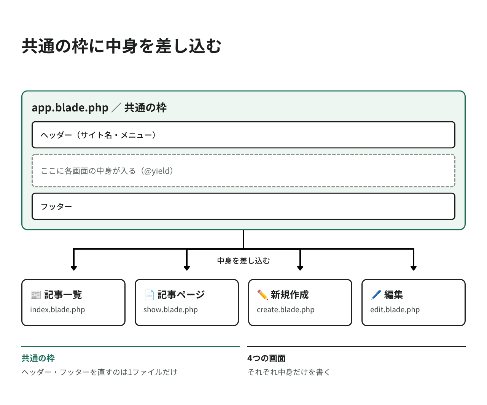
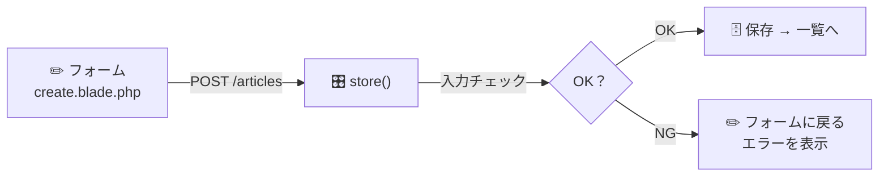

# HTMLとCSSでデザインしよう

前のページで、ブログの「中身」を作りました。
このページでは、実際に目に見える画面を作ります。

## 作業時間の目安

約45〜60分

## このページのゴール

4つの画面を作ります。

| 画面 | ファイル |
|---|---|
| 記事一覧 | `articles/index.blade.php` |
| 記事ページ | `articles/show.blade.php` |
| 新規作成 | `articles/create.blade.php` |
| 編集 | `articles/edit.blade.php` |

画面の行き来は [01. はじめに](./01.md) の図を参照してください。

---

## Step 1 レイアウトファイルを作る

### 共通部分は1か所にまとめる

4つの画面には、同じ部分（ヘッダー、フッターなど）があります。
毎回同じHTMLを書くのは大変なので、共通部分を1つのファイルにまとめて使い回します。



### 1-1. フォルダを作る

VS Code で `resources/views` の中に、以下の2つのフォルダを作ります。

- `layouts` フォルダ
- `articles` フォルダ

> メンター視点
> - VS Code での作り方: `resources/views` を右クリック →「新しいフォルダー」
> - フォルダ名のスペルミス（`layout` / `article` と単数形にしてしまう）に注意してください。どちらも複数形です

ターミナルで作ることもできます。

#### macOS / Linux / WSL

```bash
mkdir -p resources/views/layouts resources/views/articles
```

#### Windows

```powershell
mkdir resources\views\layouts, resources\views\articles
```

### 1-2. レイアウトファイルを作る

`resources/views/layouts/app.blade.php` を作って、以下を貼り付けます。

> メンター視点
> - ファイルの作り方: `layouts` フォルダを右クリック →「新しいファイル」→ `app.blade.php` と入力
> - 拡張子は `.blade.php` です。`.php` だけにならないよう注意してください
> - コードはすべてコピー＆ペーストで大丈夫です

```blade
<!DOCTYPE html>
<html lang="ja">
<head>
    <meta charset="UTF-8">
    <meta name="viewport" content="width=device-width, initial-scale=1.0">
    <title>@yield('title', 'わたしのブログ')</title>
    @vite(['resources/css/app.css', 'resources/js/app.js'])
</head>
<body class="min-h-screen bg-gray-100 text-gray-800">
    <div class="mx-auto max-w-3xl px-4 py-8">

        <header class="mb-8 flex items-center justify-between">
            <a href="{{ route('articles.index') }}" class="text-2xl font-bold text-gray-900">
                📝 わたしのブログ
            </a>
            <a href="{{ route('articles.create') }}"
               class="rounded-lg bg-blue-600 px-4 py-2 text-white shadow-sm hover:bg-blue-700">
                + 新しい記事
            </a>
        </header>

        @if (session('success'))
            <div class="mb-6 rounded-lg border border-green-300 bg-green-100 px-4 py-3 text-green-800">
                {{ session('success') }}
            </div>
        @endif

        <main>
            @yield('content')
        </main>

        <footer class="mt-12 border-t border-gray-300 pt-6 text-center text-sm text-gray-500">
            &copy; {{ date('Y') }} わたしのブログ
        </footer>

    </div>
</body>
</html>
```

### Blade（ブレード）の書き方

`.blade.php` は、HTML に Laravel の便利な書き方を足したものです。

| 書き方 | 意味 |
|--------|------|
| `@yield('content')` | ここに各ページの中身が差し込まれる |
| `{{ $変数 }}` | 変数の中身を表示する |
| `@if (...) ... @endif` | 条件によって表示を切り替える |
| `{{ route('articles.index') }}` | 04 でつけた名前からURLを作る |
| `@vite([...])` | CSS / JavaScript を読み込む |

> 💡 `{{ }}` は安全装置つき
> `{{ }}` で表示すると、HTMLタグがそのまま文字として表示されます。
> これにより、悪意のあるコードを埋め込まれる攻撃（XSS）を防げます。Laravel が自動でやってくれます。

---

## Step 2 記事一覧の画面を作る

`resources/views/articles/index.blade.php` を作って、以下を貼り付けます。

```blade
@extends('layouts.app')

@section('title', 'わたしのブログ')

@section('content')
    <form method="GET" action="{{ route('articles.index') }}" class="mb-6">
        <label for="month" class="mr-2 text-sm text-gray-600">月別アーカイブ</label>
        <select name="month" id="month" onchange="this.form.submit()"
                class="rounded-lg border border-gray-300 bg-white px-3 py-2 shadow-sm focus:border-blue-500 focus:ring-2 focus:ring-blue-200">
            @foreach ($months as $value => $label)
                <option value="{{ $value }}" {{ $month === $value ? 'selected' : '' }}>
                    {{ $label }}
                </option>
            @endforeach
        </select>
    </form>

    @if ($articles->isEmpty())
        <div class="rounded-lg bg-white p-8 text-center text-gray-500 shadow-sm">
            この月の記事はまだありません。<br>
            右上の「+ 新しい記事」から書いてみましょう！
        </div>
    @else
        <div class="space-y-4">
            @foreach ($articles as $article)
                <a href="{{ route('articles.show', $article) }}"
                   class="block rounded-lg bg-white p-5 shadow-sm transition hover:shadow-md">
                    <time class="text-sm text-gray-500">
                        {{ $article->published_on->format('Y年n月j日') }}
                    </time>
                    <h2 class="mt-1 text-xl font-bold text-gray-900">
                        {{ $article->title }}
                    </h2>
                    <p class="mt-2 text-gray-600">
                        {{ Str::limit($article->body, 100) }}
                    </p>
                </a>
            @endforeach
        </div>
    @endif
@endsection
```

### ポイント

| 書いたコード | 意味 |
|------------|------|
| `@extends('layouts.app')` | Step 1 で作った共通の枠を使う |
| `@section('content') ... @endsection` | この中身が `@yield('content')` に差し込まれる |
| `@foreach ($articles as $article)` | 記事の数だけ繰り返し表示する |
| `$article->published_on->format('Y年n月j日')` | 日付を「2026年9月5日」の形にする |
| `Str::limit($article->body, 100)` | 本文を100文字までに切る（一覧では冒頭だけ表示） |
| `onchange="this.form.submit()"` | 月を選んだら自動で送信する |

---

## Step 3 記事ページを作る

`resources/views/articles/show.blade.php` を作って、以下を貼り付けます。

```blade
@extends('layouts.app')

@section('title', $article->title . ' - わたしのブログ')

@section('content')
    <article class="rounded-lg bg-white p-6 shadow-sm">
        <time class="text-sm text-gray-500">
            {{ $article->published_on->format('Y年n月j日') }}
        </time>
        <h1 class="mt-1 text-2xl font-bold text-gray-900">
            {{ $article->title }}
        </h1>

        <div class="mt-6 leading-relaxed text-gray-700">
            {!! nl2br(e($article->body)) !!}
        </div>
    </article>

    <div class="mt-6 flex items-center justify-between">
        <a href="{{ route('articles.index') }}" class="text-gray-600 hover:text-gray-900">
            ← 記事一覧にもどる
        </a>
        <a href="{{ route('articles.edit', $article) }}"
           class="rounded-lg border border-gray-300 bg-white px-4 py-2 shadow-sm hover:bg-gray-50">
            編集する
        </a>
    </div>
@endsection
```

> 💡 `{!! nl2br(e($article->body)) !!}` の意味
> 本文の改行を画面上でも改行として表示するためのおまじないです。
>
> | 部分 | 役割 |
> |------|------|
> | `e(...)` | HTMLタグを無効化して安全にする |
> | `nl2br(...)` | 改行を `<br>` に変換する |
> | `{!! !!}` | `<br>` をタグとしてそのまま出力する |
>
> 順番が大事です。先に `e()` で安全にしてから `nl2br()` をかけています。

---

## Step 4 新規作成の画面を作る

`resources/views/articles/create.blade.php` を作って、以下を貼り付けます。

```blade
@extends('layouts.app')

@section('title', '新しい記事 - わたしのブログ')

@section('content')
    <div class="rounded-lg bg-white p-6 shadow-sm">
        <h1 class="mb-6 text-xl font-bold">新しい記事を書く</h1>

        <form method="POST" action="{{ route('articles.store') }}">
            @csrf

            <div class="mb-4">
                <label for="title" class="mb-1 block text-sm font-medium text-gray-700">タイトル</label>
                <input type="text" name="title" id="title" value="{{ old('title') }}"
                       class="w-full rounded-lg border border-gray-300 px-3 py-2 shadow-sm focus:border-blue-500 focus:ring-2 focus:ring-blue-200">
                @error('title')
                    <p class="mt-1 text-sm text-red-600">{{ $message }}</p>
                @enderror
            </div>

            <div class="mb-4">
                <label for="published_on" class="mb-1 block text-sm font-medium text-gray-700">公開日</label>
                <input type="date" name="published_on" id="published_on"
                       value="{{ old('published_on', date('Y-m-d')) }}"
                       class="w-full rounded-lg border border-gray-300 px-3 py-2 shadow-sm focus:border-blue-500 focus:ring-2 focus:ring-blue-200">
                @error('published_on')
                    <p class="mt-1 text-sm text-red-600">{{ $message }}</p>
                @enderror
            </div>

            <div class="mb-6">
                <label for="body" class="mb-1 block text-sm font-medium text-gray-700">本文</label>
                <textarea name="body" id="body" rows="12"
                          class="w-full rounded-lg border border-gray-300 px-3 py-2 shadow-sm focus:border-blue-500 focus:ring-2 focus:ring-blue-200">{{ old('body') }}</textarea>
                @error('body')
                    <p class="mt-1 text-sm text-red-600">{{ $message }}</p>
                @enderror
            </div>

            <div class="flex items-center justify-between">
                <a href="{{ route('articles.index') }}" class="text-gray-600 hover:text-gray-900">
                    ← キャンセル
                </a>
                <button type="submit"
                        class="rounded-lg bg-blue-600 px-6 py-2 text-white shadow-sm hover:bg-blue-700">
                    公開する
                </button>
            </div>
        </form>
    </div>
@endsection
```

### フォームの仕組み



| 書いたコード | 意味 |
|------------|------|
| `@csrf` | なりすまし送信を防ぐための合言葉。Laravel のフォームには必須です |
| `@error('title') ... @enderror` | その項目にエラーがあれば表示 |
| `old('title')` | エラーで戻ってきたとき、入力内容を消さずに残す |
| `old('published_on', date('Y-m-d'))` | 初期値として今日の日付を入れる |

> 💡 `@csrf` を忘れると？
> 「419 Page Expired」というエラーが出ます。フォームを作ったのに保存できないときは、
> まず `@csrf` があるか確認しましょう。

---

## Step 5 編集の画面を作る

`resources/views/articles/edit.blade.php` を作って、以下を貼り付けます。

```blade
@extends('layouts.app')

@section('title', '記事を編集 - わたしのブログ')

@section('content')
    <div class="rounded-lg bg-white p-6 shadow-sm">
        <h1 class="mb-6 text-xl font-bold">記事を編集する</h1>

        <form method="POST" action="{{ route('articles.update', $article) }}">
            @csrf
            @method('PUT')

            <div class="mb-4">
                <label for="title" class="mb-1 block text-sm font-medium text-gray-700">タイトル</label>
                <input type="text" name="title" id="title" value="{{ old('title', $article->title) }}"
                       class="w-full rounded-lg border border-gray-300 px-3 py-2 shadow-sm focus:border-blue-500 focus:ring-2 focus:ring-blue-200">
                @error('title')
                    <p class="mt-1 text-sm text-red-600">{{ $message }}</p>
                @enderror
            </div>

            <div class="mb-4">
                <label for="published_on" class="mb-1 block text-sm font-medium text-gray-700">公開日</label>
                <input type="date" name="published_on" id="published_on"
                       value="{{ old('published_on', $article->published_on->format('Y-m-d')) }}"
                       class="w-full rounded-lg border border-gray-300 px-3 py-2 shadow-sm focus:border-blue-500 focus:ring-2 focus:ring-blue-200">
                @error('published_on')
                    <p class="mt-1 text-sm text-red-600">{{ $message }}</p>
                @enderror
            </div>

            <div class="mb-6">
                <label for="body" class="mb-1 block text-sm font-medium text-gray-700">本文</label>
                <textarea name="body" id="body" rows="12"
                          class="w-full rounded-lg border border-gray-300 px-3 py-2 shadow-sm focus:border-blue-500 focus:ring-2 focus:ring-blue-200">{{ old('body', $article->body) }}</textarea>
                @error('body')
                    <p class="mt-1 text-sm text-red-600">{{ $message }}</p>
                @enderror
            </div>

            <div class="flex items-center justify-between">
                <a href="{{ route('articles.show', $article) }}" class="text-gray-600 hover:text-gray-900">
                    ← キャンセル
                </a>
                <div class="flex gap-2">
                    <button type="submit" form="delete-form"
                            onclick="return confirm('この記事を削除します。よろしいですか？')"
                            class="rounded-lg bg-red-600 px-4 py-2 text-white shadow-sm hover:bg-red-700">
                        削除
                    </button>
                    <button type="submit"
                            class="rounded-lg bg-blue-600 px-6 py-2 text-white shadow-sm hover:bg-blue-700">
                        更新する
                    </button>
                </div>
            </div>
        </form>

        <form id="delete-form" method="POST" action="{{ route('articles.destroy', $article) }}" class="hidden">
            @csrf
            @method('DELETE')
        </form>
    </div>
@endsection
```

### ポイント

| 書いたコード | 意味 |
|------------|------|
| `@method('PUT')` | HTMLのフォームは GET と POST しか送れないので、「本当は PUT です」と伝えるおまじない |
| `@method('DELETE')` | 同じく「本当は DELETE です」 |
| `old('title', $article->title)` | 通常は今の記事の内容を、エラー時は入力していた内容を表示 |
| `onclick="return confirm(...)"` | 削除前に「よろしいですか？」と確認する |
| `form="delete-form"` | 削除ボタンを、下にある削除用フォームとひも付ける |

> 💡 なぜ削除用のフォームが別にあるの？
> HTML では、フォームの中にフォームを入れられないためです。
> 削除用フォームを別に用意して、ボタンから `form="delete-form"` で指定しています。

---

## Step 6 CSS を確認する

`resources/css/app.css` を開いてみてください。以下のようになっているはずです。

```css
@import 'tailwindcss';

@source '../../vendor/laravel/framework/src/Illuminate/Pagination/resources/views/*.blade.php';
@source '../../storage/framework/views/*.php';

@theme {
    --font-sans: 'Instrument Sans', ui-sans-serif, system-ui, sans-serif, ...;
}
```

このファイルは変更しなくてOKです。

1行目の `@import 'tailwindcss';` だけで、Tailwind CSS v4 がすべて読み込まれます。

> ⚠️ ネットの古い記事に注意
> Tailwind CSS v3 では `@tailwind base;` `@tailwind components;` `@tailwind utilities;` と3行書く必要がありました。
> v4 では `@import 'tailwindcss';` の1行だけです。書き換えないでください。

### Tailwind CSS とは？

クラス名を並べるだけで見た目を作れる CSS の道具です。

```html
<!-- 普通のCSS：別ファイルにスタイルを書く -->
<div class="card">...</div>

<!-- Tailwind：クラス名で直接指定する -->
<div class="rounded-lg bg-white p-6 shadow-sm">...</div>
```

| クラス | 意味 |
|--------|------|
| `bg-white` | 背景色を白に |
| `p-6` | 内側の余白（padding） |
| `mb-4` | 下方向の外側の余白（margin-bottom） |
| `text-xl` | 文字サイズを大きく |
| `font-bold` | 太字に |
| `rounded-lg` | 角を丸く |
| `shadow-sm` | 影をつける |
| `flex` | 横並びにする |
| `hover:bg-blue-700` | マウスを乗せたときの背景色 |

数字が大きいほど、余白やサイズが大きくなります（`p-2` < `p-4` < `p-6`）。

---

## Step 7 ビルドして動かしてみる

### 7-1. CSS を組み立てる

```bash
npm run build
```

Vite が、Tailwind CSS を実際に使えるCSSファイルに組み立ててくれます。

> ⚠️ なぜ今もう一度ビルドするの？
> Tailwind CSS は、実際に使われているクラスだけを集めてCSSを作ります。
> Step 1〜5 で新しいクラス（`rounded-lg` など）を書いたので、
> CSSを作り直さないと反映されません。
>
> クラス名を変えたら `npm run build` — これはこの先ずっとセットです。

> メンター視点
> - 数秒〜1分程度かかります。緑色の完了表示が出れば成功です
> - `npm run dev` を使うと、ファイルを保存するたびに自動で組み立て直してくれます（開発中は便利）
> - ただし `npm run dev` は起動しっぱなしになるため、ターミナルがもう1つ必要です。当日は `npm run build` で十分です

### 7-2. サーバーを起動（止まっている場合）

```bash
php artisan serve
```

### 7-3. ブラウザで確認

[http://localhost:8000](http://localhost:8000) を開いてください。

ブログの記事一覧が表示されれば成功です！ 🎉

### 7-4. 動作チェック

以下を上から順に試してみましょう。

| # | やること | 期待する結果 |
|---|---------|------------|
| 1 | トップページを開く | 「この月の記事はまだありません」と表示される |
| 2 | 「+ 新しい記事」をクリック | 入力フォームが表示される |
| 3 | 何も入力せず「公開する」 | 赤いエラーメッセージが3つ出る |
| 4 | タイトル・本文を入力して「公開する」 | 一覧に戻り、緑のメッセージと記事が表示される |
| 5 | 記事をクリック | 記事ページで本文が読める |
| 6 | 「編集する」→ 内容を変えて「更新する」 | 変更が反映される |
| 7 | 編集画面で「削除」→ OK | 記事が消える |
| 8 | 月別アーカイブを切り替える | 選んだ月の記事だけが表示される |

> メンター視点
> - ③のバリデーションチェックは必ず一緒にやってください。「ちゃんとエラーになる」体験は理解が深まります
> - この動作確認は参加者と一緒に画面を見ながら行いましょう
> - うまく動いたら、しっかり褒めてあげてください。ここが一番の達成ポイントです 🎉

---

## 🎉 ブログが完成しました！

おめでとうございます！自分のブログが動きました。

記事を2〜3件書いてみましょう。書いた記事はデータベースに保存されているので、
サーバーを再起動しても消えません。

でも、まだこのパソコンでしか見られません。
次のページから、インターネットに公開して自分のURLを手に入れましょう！

---

## 自分色にカスタマイズしてみよう

公開する前に、少し自分らしくしてみましょう。変更したら `npm run build` を忘れずに！

### ブログの名前を変える

`layouts/app.blade.php` の「わたしのブログ」を、好きな名前に変えてみてください。
（3か所あります: `<title>`、ヘッダー、フッター）

```blade
📝 わたしのブログ  →  🍜 札幌ラーメン日記
```

### 色を変える

`bg-blue-600` などの色クラスを変えてみてください。

| クラス | 色 |
|--------|-----|
| `bg-red-600` | 赤 |
| `bg-green-600` | 緑 |
| `bg-purple-600` | 紫 |
| `bg-pink-600` | ピンク |
| `bg-orange-600` | オレンジ |
| `bg-gray-800` | 黒に近いグレー |

> 💡 ボタンは `bg-blue-600` と `hover:bg-blue-700` がセットです。両方変えると自然に仕上がります。

### 背景の色を変える

`<body class="min-h-screen bg-gray-100 ...">` の `bg-gray-100` を変えてみてください。

- `bg-white` …真っ白
- `bg-amber-50` …少しあたたかい色
- `bg-slate-900 text-gray-100` …ダークテーマ風

### 絵文字を変える

`📝` の部分を好きな絵文字に変えてみましょう。`🍜` `⚽️` `🎮` `📚` `🐈` `🏔`

> メンター視点
> - カスタマイズは「自分のものになった」実感が生まれる大事な時間です
> - 色の一覧は [Tailwind公式のカラーパレット](https://tailwindcss.com/docs/colors) を見せると盛り上がります
> - 変更 → `npm run build` → ブラウザ再読み込み、の流れを最初に一緒にやってあげてください

---

## トラブルシューティング

| 症状 | 原因と対処 |
|------|-----------|
| 画面が真っ白／デザインが崩れる | `npm run build` を実行しましたか？ |
| スタイルが反映されない | ブラウザで強制リロード（macOS: `Cmd + Shift + R` / Windows・Linux: `Ctrl + F5`） |
| `View [articles.index] not found` | ファイル名・フォルダ名を確認。`articles`（複数形）、拡張子は `.blade.php` |
| 419 Page Expired | フォームに `@csrf` があるか確認 |
| `Undefined variable $articles` | コントローラーの `compact(...)` にその名前が入っているか確認 |
| 更新・削除が動かない | `@method('PUT')` / `@method('DELETE')` があるか確認 |
| 日付が `format()` でエラー | `Article` モデルの `casts()` に `'published_on' => 'date'` があるか確認 |

---

次のガイド: [GitHubでコードを管理しよう](./06.md)
