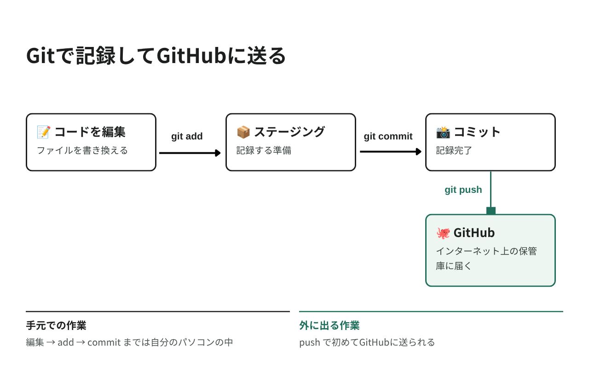

# GitHubでコードを管理しよう

作ったブログを、インターネットに公開する準備をします。

## 作業時間の目安

約30分

## このページのゴール

このページが終わると、`blog-app` のコードが GitHub（ギットハブ）上に保管された状態になります。
次のページで、その GitHub のコードから自分のブログを公開します。

---

## Gitとは？GitHubとは？

### Git（ギット）

Git は、コードの変更履歴を記録する道具です。

ゲームの「セーブ」に似ています。

- こまめにセーブしておけば、失敗しても戻れる
- いつ・誰が・何を変えたかが分かる
- 複数人で同じコードを編集できる

### GitHub（ギットハブ）

GitHub は、Git で記録したコードをインターネット上に保管・共有できるサービスです。無料で使えます。

| | Git | GitHub |
|---|-----|--------|
| 何？ | 道具（自分のパソコンで動く） | サービス（インターネット上） |
| 例えると | 写真を撮るカメラ | 写真を保管するクラウド |

> 💡 世界中のプログラマーが GitHub を使っています。
> GitHub のアカウントは、エンジニアの名刺のようなものです。就職・転職でも見られます。



---

## Step 1 GitHub アカウントを作る

すでに持っている方は Step 2 へ進んでください。

1. [https://github.com/](https://github.com/) を開く
2. 「Sign up」をクリック
3. メールアドレス・パスワード・ユーザー名を入力
4. 届いたメールで認証を完了

> 💡 ユーザー名は公開されます。GitHubのURL（`https://github.com/ユーザー名`）に使われます。
> 本名でなくても構いません。あとから変更もできます。

> メンター視点
> - ユーザー名は後で Render との連携にも使います。メモしてもらうと安心です
> - パスワードは必ず控えてもらってください（次のページでも GitHub にログインします）

---

## Step 2 GitHub CLI をインストール

GitHub とやりとりするための道具（`gh` コマンド）を入れます。
これを使うと、パスワードやトークンの面倒な設定なしで GitHub に接続できます。

> 💡 `gh` を使わない方法もあります
> インストールでつまずいた方、画面の操作で進めたい方は、このページ末尾の
> 「付録 gh を使わずに VS Code から公開する」を見てください。
> どちらの方法でも、このページのゴール（コードが GitHub にある状態）は同じです。

> ⚠️ Linux / WSL をお使いの方へ
> `gh` のインストールは、このガイドでは macOS / Windows でのみ動作確認しています。
> Linux / WSL の方は、Step 2 と Step 4 を飛ばして
> 「付録 gh を使わずに VS Code から公開する」に進んでください。

### macOS

1. [https://github.com/cli/cli/releases/latest](https://github.com/cli/cli/releases/latest) を開く
2. ページ下部の「Assets」を開き、`gh_x.x.x_macOS_universal.pkg` をダウンロード
3. ダウンロードしたファイルを開いてインストール（すべて「続ける」でOK）

> 💡 ファイルがたくさん並んでいますが、名前に `macOS_universal.pkg` を含むものを選んでください。
> Intel Mac でも Apple シリコンでも、これ1つで動きます。

### Windows

1. [https://github.com/cli/cli/releases/latest](https://github.com/cli/cli/releases/latest) を開く
2. ページ下部の「Assets」を開き、`gh_x.x.x_windows_amd64.msi` をダウンロード
3. ダウンロードしたファイルを実行してインストール（すべてデフォルトのまま）

> 💡 PowerShell が使える方は、以下のコマンドでも入ります。
> ```powershell
> winget install --id GitHub.cli
> ```

### Linux / WSL
「付録 gh を使わずに VS Code から公開する」（このページ末尾）に進んでください。
Step 2 と Step 4 は飛ばして構いません。

> 💡 すでに `gh` が使える方へ
> ターミナルで `gh --version` を実行してバージョンが表示される場合は、
> そのまま Step 3 に進んで大丈夫です。

> メンター視点
> - Linux / WSL の参加者には、最初から付録の方法を案内してください。所要時間が読めます
> - `gh` を入れたがる方がいても、当日は止めてください。詰まったときに切り分ける時間がありません

### 確認

ターミナルを新しく開いて、以下を実行します。

```bash
gh --version
```

`gh version 2.x.x` と表示されればOKです。

> メンター視点
> - ここでもターミナルの開き直しが必要です
> - macOS で Homebrew を入れている方は `brew install gh` が最短です
> - Releases ページはファイルが多く迷いやすいので、画面を一緒に見てあげてください

---

## Step 3 Git の初期設定

Git に「あなたが誰か」を教えます。最初の1回だけ必要な設定です。

```bash
git config --global user.name "あなたの名前"
git config --global user.email "your-email@example.com"
```

例
```bash
git config --global user.name "Hanako Yamada"
git config --global user.email "hanako@example.com"
```

> ⚠️ ここで設定した名前とメールアドレスは、コードと一緒に公開されます。
> 本名を使いたくない場合はニックネームを、メールアドレスを隠したい場合は
> GitHub が用意する非公開アドレス（`123456+ユーザー名@users.noreply.github.com`）を使ってください。
> 非公開アドレスは GitHub の Settings → Emails で確認できます。

### 確認

```bash
git config --global user.name
git config --global user.email
```

設定した内容が表示されればOKです。

---

## Step 4 GitHub にログインする

> 💡 付録（VS Code から公開する方法）で進める方は、この Step は不要です。Step 5 に進んでください。

```bash
gh auth login
```

いくつか質問されます。以下のとおりに答えてください。

| # | 質問 | 答え |
|---|------|------|
| 1 | `What account do you want to log into?` | GitHub.com（そのまま Enter） |
| 2 | `What is your preferred protocol...?` | HTTPS（そのまま Enter） |
| 3 | `Authenticate Git with your GitHub credentials?` | Yes（`Y` を押して Enter） |
| 4 | `How would you like to authenticate?` | Login with a web browser（そのまま Enter） |

すると、8桁のコード（例: `A1B2-C3D4`）が表示されます。

1. コードをコピーする
2. Enter を押すとブラウザが開く
3. コードを貼り付けて「Continue」
4. 「Authorize github」をクリック

ターミナルに `✓ Logged in as あなたのユーザー名` と表示されれば成功です！

> メンター視点
> - ブラウザで GitHub にログインしていない場合、先にログインを求められます
> - コードの貼り付けを忘れて詰まるケースが多いので、画面を一緒に見てあげてください

---

## Step 5 プロジェクトを Git で管理する

### 5-1. プロジェクトフォルダにいることを確認

```bash
pwd
```

末尾が `blog-app` になっていることを確認してください。なっていなければ移動します。

#### macOS

```bash
cd ~/Desktop/blog-app
```

#### Windows

```powershell
cd $HOME\Desktop\blog-app
```

#### Linux / WSL

```bash
cd ~/projects/blog-app
```

### 5-2. Git リポジトリを作る

```bash
git init -b main
```

以下のように表示されます。

```
Initialized empty Git repository in .../blog-app/.git/
```

これで、このフォルダが Git で管理される場所（リポジトリ）になりました。

> 💡 `-b main` とは？
> 最初の枝（ブランチ）の名前を `main` にする指定です。GitHub の標準がこの名前です。

### 5-3. 記録する内容を確認

```bash
git status
```

たくさんのファイル名が赤字で表示されます。これは「まだ記録されていないファイル」という意味です。

> 💡 `.env` と `vendor` は表示されていないはずです。
> Laravel が最初から用意している `.gitignore` というファイルで、
> アップロードしてはいけないものを除外しているためです。
>
> | 除外されるもの | 理由 |
> |--------------|------|
> | `.env` | パスワードなどの秘密情報が入っている |
> | `vendor/` | Composer で再ダウンロードできるので不要 |
> | `node_modules/` | npm で再ダウンロードできるので不要 |
> | `database/database.sqlite` | あなたの記事データそのもの |

### 5-4. ステージング（記録する準備）

```bash
git add .
```

`.` は「すべてのファイル」という意味です。

### 5-5. コミット（記録する）

```bash
git commit -m "ブログアプリを作成"
```

`-m` の後ろに、何をしたかの説明を書きます。

```
[main (root-commit) xxxxxxx] ブログアプリを作成
 xx files changed, xxxx insertions(+)
```

これで、この時点の状態が記録されました。いつでもここに戻れます。

---

## Step 6 GitHub にアップロードする

### 6-1. リポジトリを作って一気にアップロード

> 💡 `gh` を入れていない方は、ここから「付録 gh を使わずに VS Code から公開する」（このページ末尾）に進んでください。

```bash
gh repo create blog-app --public --source=. --push
```

これ1つで、以下がまとめて実行されます。

1. GitHub に置き場所（リポジトリ）を作る
2. 自分のパソコンとひも付ける
3. コードをアップロードする

| オプション | 意味 |
|-----------|------|
| `blog-app` | GitHub 上のリポジトリ名 |
| `--public` | 誰でも見られる公開リポジトリにする |
| `--source=.` | 今いるフォルダの中身を使う |
| `--push` | 作成後、すぐアップロードする |

> 💡 `--public` で大丈夫？
> はい。パスワードなどの秘密情報が入った `.env` はアップロードされないためです。
> 気になる方は `--public` の代わりに `--private`（自分だけ見られる）でもOKです。
> ただし次のページの公開手順は、どちらでも問題なく進められます。

### 6-2. GitHub で確認

ブラウザで以下を開いてください。

```
https://github.com/あなたのユーザー名/blog-app
```

ターミナルから開くこともできます。

```bash
gh repo view --web
```

ファイル一覧が表示されていれば成功です！ 🎉

あなたのコードが、インターネット上に保管されました。

> メンター視点
> - ここで一度「自分の書いたコードがネットに載った」実感を持ってもらうと、次の公開への期待が高まります
> - `.env` が無いことを一緒に確認すると、秘密情報の扱いの学びになります

---

## これからの流れ（変更を反映する方法）

コードを変更したら、以下の3ステップで GitHub に反映します。この3つはセットで覚えてください。

```bash
git add .
git commit -m "ブログの色を変更"
git push
```

### 変更内容を確認したいとき

```bash
git status
```

---

## まとめ

### 覚えるコマンド

| コマンド | 説明 | いつ使う |
|---------|------|---------|
| `git status` | 変更されたファイルを確認 | いつでも |
| `git add .` | すべての変更を記録の準備 | 記録する前 |
| `git commit -m "説明"` | 変更を記録する | 区切りのいいところで |
| `git push` | GitHub にアップロード | 記録したあと |

この4つだけ覚えれば、当面は困りません。

### よくある質問

Q. `.env` ファイルが GitHub に公開されませんか？

A. 大丈夫です。Laravel が `.gitignore` で `.env` を除外しています。
`git status` に `.env` が出てこないことが、その証拠です。

Q. コミットメッセージは日本語でもいい？

A. はい、問題ありません。チーム開発では英語が推奨されることもありますが、
今は自分が後で読んで分かることが一番大事です。

Q. どのくらいの頻度でコミットすればいい？

A. 「1つの機能ができた」「動作確認できた」など、区切りのいいところで。
細かすぎて困ることはありません。

Q. 間違えてコミットしてしまった

A. 慌てず、メンターに相談してください。Git はほとんどの操作をやり直せます。

---

## トラブルシューティング

| 症状 | 対処 |
|------|------|
| `gh: command not found` | ターミナルを開き直してください。それでも直らなければ、付録の VS Code から公開する方法へ |
| `gh` がどうしても入らない | 付録の VS Code から公開する方法に切り替えてください |
| `fatal: not a git repository` | `pwd` で `blog-app` にいるか確認。`git init -b main` を実行したか確認 |
| `repository already exists` | 同じ名前のリポジトリがすでにあります。`gh repo create my-blog --public --source=. --push` のように別名にしてください |
| `git push` で認証エラー | `gh auth login` をやり直してください |
| コミットできない（`nothing to commit`） | 変更がありません。ファイルを保存したか確認してください |

---

## 付録 gh を使わずに VS Code から公開する

`gh` を使わずに、VS Code の画面だけで GitHub に公開する方法です。
やること（GitHub にリポジトリを作って、コードを送る）は Step 6 と同じです。

VS Code は 03 ですでに入れているので、追加のインストールは必要ありません。

| この方法を使う場合 | |
|---|---|
| 必要なもの | Step 1 の GitHub アカウント、Step 5 まで（`git init` 〜 `git commit`）が終わっていること |
| 飛ばしてよい手順 | Step 2（`gh` のインストール）、Step 4（`gh auth login`）、Step 6 |

> メンター視点
> - Linux / WSL の参加者は、全員この方法で進めてもらってください
> - macOS / Windows でも、`gh` のインストールで5分以上つまずいたらこちらに切り替えるのが安全です
> - どの方法で公開しても、07（Render）の手順はまったく同じです

### 手順

1. VS Code で `blog-app` フォルダを開く
2. 左側の枝分かれのアイコン（ソース管理）をクリック
3. 「Branch の発行」（Publish Branch）ボタンをクリック
4. GitHub へのサインインを求められるので、ブラウザで許可する
5. 「Publish to GitHub public repository」を選ぶ

これで、リポジトリの作成とアップロードが同時に終わります。

> 💡 `public` と `private` のどちらを選んでも構いません。
> `public`（誰でも見られる）で問題ないのは、パスワードなどが入った `.env` がアップロードされないためです。

> 💡 WSL をお使いの方も、この方法が使えます。
> VS Code の左下に `WSL: Ubuntu` と表示されている状態で操作してください。

### 確認

ブラウザで以下を開いて、ファイル一覧が表示されれば成功です。

```
https://github.com/あなたのユーザー名/blog-app
```

あなたのコードが、インターネット上に保管されました。 🎉

### これ以降、変更を反映するとき

どちらのやり方でも構いません。

| やり方 | 手順 |
|--------|------|
| VS Code の画面 | ソース管理でメッセージを入力 →「コミット」→「変更の同期」 |
| ターミナル | `git add .` → `git commit -m "説明"` → `git push` |

07 では `git push` を使うので、ターミナルのやり方も一度試しておくと安心です。

> メンター視点
> - サインインの画面がブラウザに移るので、見失う方がいます。画面を一緒に追ってあげてください
> - 「Branch の発行」が見当たらない場合は、Step 5 の `git commit` が終わっていない可能性があります。先にコミットしてもらってください

---

## 次のステップ

コードが GitHub に置けました。
いよいよ次のページで、インターネットに公開して自分のURLを手に入れます！

---

次のガイド: [インターネットに公開しよう](./07.md)
