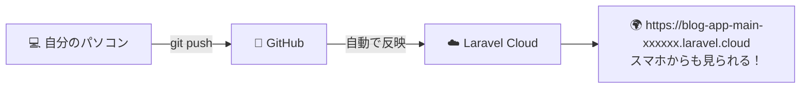
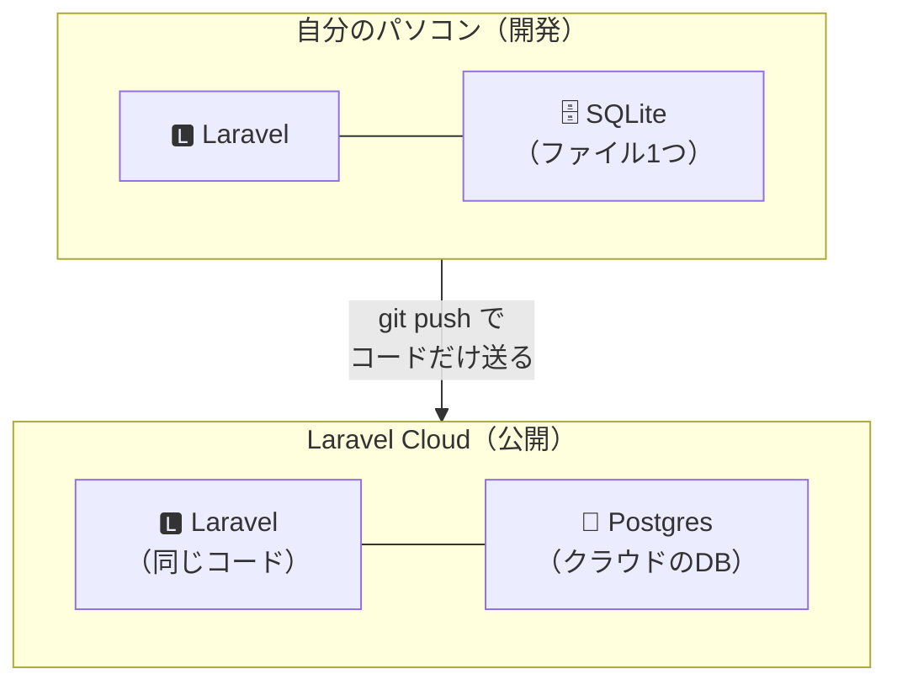
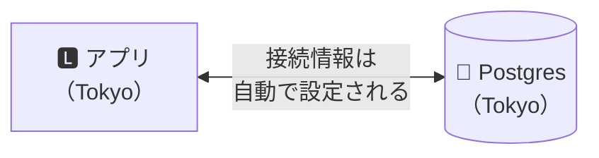
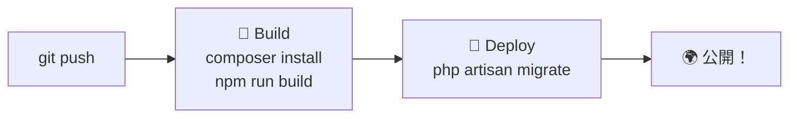
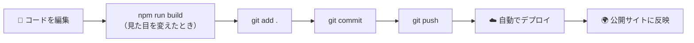

# インターネットに公開しよう

いよいよ最後のステップです。
作ったブログをインターネットに公開して、自分のURLを手に入れましょう。

公開先には、Laravel 公式のサービス Laravel Cloud（ララベル・クラウド）を使います。

## 作業時間の目安

約30〜45分

## このページのゴール



一度つないでしまえば、あとは `git push` するだけで公開サイトが更新されます。

---

## ⚠️ はじめに：料金についての大事な説明

Laravel Cloud は無料で始められますが、プラン（Starter）への登録が必要です。
登録の途中で、支払い方法（クレジットカード）の入力を求められる場合があります。

| 項目 | 内容 |
|------|------|
| Starter プラン | 初月無料（30日間のトライアル） |
| 2ヶ月目以降 | $5/月 ＋ 使った分（毎月 $5 分の利用クレジット込み） |
| 使わないとき | 自動で停止（スリープ）するので、費用はほとんどかかりません |
| やめたいとき | プランを解約すれば費用は止まります（手順はこのページの最後） |

> 💡 「今日だけ試したい」場合
> イベント後にアプリを削除し、プランを解約すれば追加費用はかかりません。
> 手順はこのページの最後「後片付けのしかた」に書いてあります。

> ⚠️ 支払い情報を登録したくない方へ
> 無理に登録する必要はありません。メンターに声をかけてください。
> このページを飛ばして、[08 発展課題](./08.md) に進んでも大丈夫です。
> ブログは自分のパソコンの中で問題なく動き続けます。

> メンター視点
> - 支払い情報の登録に抵抗がある参加者は必ずいます。責める空気を作らないでください
> - 登録しない参加者向けに、メンターのアカウントで一緒にデプロイして画面を見せる代替案が有効です
> - 事前案内で「公開には Laravel Cloud の無料プラン登録が必要（支払い方法の入力を求められる場合あり）」と伝えておくと当日スムーズです

> 📌 運営の方へ：開催前に必ず確認してください
>
> このページの料金・画面表記は、2026年8月8日時点の
> [Laravel Cloud 公式ドキュメント](https://laravel.com/cloud/docs) と [料金ページ](https://laravel.com/cloud/pricing) に基づいています。
>
> - クレジットカード入力の要否は、公式ドキュメント・料金ページに明記がありません。
>   公式ドキュメントで確認できるのは「すべての organization は有効なサブスクリプションが必要」という記述までです
>   （公式チュートリアルには「カード入力が必要」との記載がありますが、同ページには古い記述も混在しています）
> - 開催前に運営が実際に新規サインアップし、「どこでカード入力を求められるか」を確認して、
>   参加者への事前案内に反映してください
> - 料金・プラン名・ボタン名は変更されることがあります。開催前に一度、通しでデプロイして確認することを強く推奨します

---

## 公開のしくみ

その前に、何が起きるのかを見ておきましょう。



コードは同じですが、データベースだけが変わります。

### なぜ SQLite のままではダメなの？

Laravel Cloud のサーバーは、更新するたびにファイルがリセットされます。
SQLite は「ファイル1つ」にデータを保存するしくみなので、書いた記事が消えてしまいます。

そこで、公開サイトでは Postgres（ポストグレス）というデータベースを使います。

> 💡 コードは1行も変えません。
> Laravel が「どのデータベースを使うか」を設定で切り替えてくれるからです。
> これがフレームワークの便利なところです。

| | 自分のパソコン | 公開サイト |
|---|-------------|-----------|
| データベース | SQLite（ファイル） | Postgres（クラウド） |
| 記事のデータ | 別々です（同期されません） | 別々です |
| コード | 同じ | 同じ |

> ⚠️ パソコンで書いた記事は、公開サイトには反映されません。
> 公開サイトの記事は、公開サイトで書き直してください。

---

## Step 1 Laravel Cloud に登録する

### 1-1. アカウントを作る

1. [https://cloud.laravel.com/](https://cloud.laravel.com/) を開く
2. 「Sign up」（または「Get Started」）をクリック
3. GitHub アカウントでログインするのが一番かんたんです
4. 画面の案内にしたがって、Starter プランを選び、支払い情報を登録

> 💡 プランは後から変更・解約できます。まずは Starter（初月無料）で始めてください。

### 1-2. 利用上限（Spending limit）を設定する ← おすすめ

「気づいたら課金されていた」を防ぐため、利用上限（Spending limit）を設定しておきましょう。

1. 組織（Organization）のダッシュボードで Settings → Billing を開く
2. Spending limit（利用上限）に金額（例: `10`）を設定して保存

上限に達すると自動でコンピュートが停止し、それ以上は課金されません。
50% / 80% / 100% の時点で通知も届きます。

> メンター視点
> - この設定は必ず一緒にやってあげてください。参加者の安心感がまったく違います
> - 設定項目の場所は変更されることがあります。見つからない場合は Settings 内を探すか、公式ドキュメントを確認してください

---

## Step 2 GitHub とつなぐ

Laravel Cloud に、あなたの GitHub リポジトリを読む許可を与えます。

1. Laravel Cloud のダッシュボードで「+ New application」をクリック
2. 「Connect to GitHub」をクリック
3. 新しいタブが開くので、GitHub にログイン
4. どのリポジトリへのアクセスを許可するかを選ぶ
   - 「All repositories」（すべて）を選ぶのが簡単です
   - 個別に選ぶ場合は `blog-app` を必ず含めてください
5. 「Install」「Authorize」などのボタンで許可

> リポジトリが出てこないとき
> [https://github.com/apps/laravel-cloud-app/installations/select_target](https://github.com/apps/laravel-cloud-app/installations/select_target)
> を開き、自分のアカウントを選んで「All repositories」にして Save してください。

---

## Step 3 アプリケーションを作る

GitHub と繋がったら、以下を設定します。

| 項目 | 設定する内容 |
|------|------------|
| Repository | `blog-app`（06 で作ったリポジトリ） |
| Application name | `blog-app`（好きな名前でOK。URLの一部になります） |
| Region | Asia Pacific (Tokyo) を選ぶ |

そして「Create Application」をクリックします。

> 💡 なぜ Tokyo？
> 日本から一番近いので、表示が速くなります。

アプリケーションが作られ、環境（Environment）の画面に移動します。

> 💡 「環境」とは？
> 同じアプリの「本番用」「テスト用」といった置き場所のことです。
> 今回は最初から作られる1つだけを使います。

> メンター視点
> - アプリ名はURLに使われるので、参加者の好きな名前（`hanako-blog` など）にすると盛り上がります
> - リージョンを間違えると後で変更できません（アプリごと作り直しになります）。ここは一緒に確認してください

---

## Step 4 データベースを追加する

記事を保存する Postgres を用意します。

1. 環境の画面にあるインフラ図（infrastructure canvas）を表示
2. 「Add database」をクリック
3. 以下を設定
   - Cluster type: Laravel Serverless Postgres
   - Cluster name: `blog-db`（好きな名前でOK）
   - Instance size: Flex（一番小さいもの）
   - Storage: 一番小さいもの（`5GB` など）
   - Region: Asia Pacific (Tokyo)（アプリと同じにする）
4. 保存



> ⚠️ リージョンはアプリと同じにしてください。違うと接続できません。

> 💡 接続情報（ホスト名・パスワードなど）は自分で入力しません。
> データベースを追加すると、Laravel Cloud が自動でアプリに教えてくれます。

> メンター視点
> - Serverless Postgres は使っていないときスリープするので、費用はごくわずかです
> - 「パスワードを自分で管理しなくていい」のがマネージドサービスの利点だと伝えると理解が深まります

---

## Step 5 環境変数を設定する

アプリの設定（`.env` に相当するもの）を入力します。

### 5-1. APP_KEY を作る

自分のパソコンのターミナル（`blog-app` フォルダ）で以下を実行します。

```bash
php artisan key:generate --show
```

`base64:xxxxxxxxxxxxxxxxxxxxxxxxxxx=` のような文字列が表示されます。
これをコピーしてください。

> 💡 APP_KEY とは？
> Laravel がデータを暗号化するときに使う「鍵」です。人に見せてはいけません。

### 5-2. 環境変数を入力する

環境の Settings（設定）→ Environment variables を開き、以下を入力します。

```ini
APP_NAME="わたしのブログ"
APP_ENV=production
APP_KEY=ここに5-1でコピーした値を貼り付け
APP_DEBUG=false
DB_CONNECTION=pgsql
```

| 変数 | 意味 |
|------|------|
| `APP_NAME` | アプリの名前 |
| `APP_ENV=production` | 本番モードで動かす |
| `APP_KEY` | 暗号化の鍵（5-1 でコピーしたもの） |
| `APP_DEBUG=false` | エラーの詳細を訪問者に見せない（重要なセキュリティ設定） |
| `DB_CONNECTION=pgsql` | Postgres を使う（ここで SQLite から切り替わります） |

> ⚠️ `DB_HOST` や `DB_PASSWORD` は書かないでください。
> Step 4 でデータベースを追加したときに、Laravel Cloud が自動で設定しています。

> ⚠️ `APP_DEBUG=false` は必ず設定してください。
> `true` のままだと、エラー画面にデータベースのパスワードなどが表示されてしまいます。

> メンター視点
> - `APP_DEBUG` の危険性は、実際に `true` のエラー画面を見せると一発で伝わります（見せるならローカルで）
> - `APP_KEY` を GitHub に上げてはいけない理由（`.env` が `.gitignore` に入っている理由）とつなげて説明すると効果的です

---

## Step 6 ビルド・デプロイのコマンドを設定する

「公開するときに何をするか」を指定します。

環境の Settings → Deployments を開いて、以下を設定します。

### Build commands（組み立てるときの命令）

```bash
composer install --no-dev && npm run build
```

### Deploy commands（反映するときの命令）

```bash
php artisan migrate --force
```



| コマンド | 何をする？ |
|---------|-----------|
| `composer install --no-dev` | PHP の部品をダウンロード（開発用は除く） |
| `npm run build` | CSS を組み立てる（これが無いとデザインが崩れます） |
| `php artisan migrate --force` | データベースに表を作る（04 でやったことをクラウド上でも実行） |

> 💡 `--force` とは？
> 本番環境で `migrate` を実行するときの確認をスキップする指定です。
> 自動実行なので、確認待ちで止まらないようにしています。

> メンター視点
> - `npm run build` を忘れると「デザインが真っ白」になります。最頻出のトラブルです
> - `php artisan migrate --force` を忘れると「テーブルが無い」エラーになります

---

## Step 7 公開する

### 7-1. デプロイを実行

「Deploy」ボタンをクリックします。

ログが流れ始めます。2〜5分ほどかかります。

```
Building...
Installing dependencies...
Running deploy commands...
Deployment successful ✓
```

> メンター視点
> - 待ち時間に「今なにをしているか」（ログの読み方）を説明すると学びになります
> - 初回はキャッシュが無いので時間がかかります。2回目以降は速くなります

### 7-2. URLを開く

デプロイが成功すると、URL が表示されます。

```
https://blog-app-main-a1b2c3.laravel.cloud
```

クリックして開いてみてください。

あなたのブログが、インターネットに公開されました！ 🎉🎉🎉

### 7-3. スマホで開いてみよう

URLをスマホに送って、開いてみてください。

- LINE やメールで自分に送る
- URLの QRコードを作って読み取る

世界中のどこからでも見られます。家族や友達にも送ってみましょう！

### 7-4. 記事を書いてみる

公開サイトで「+ 新しい記事」から記事を書いてみてください。

> ⚠️ パソコンで書いた記事は入っていません。データベースが別だからです。
> 公開サイト用に、あらためて記事を書いてください。

> メンター視点
> - ここが今日いちばんの山場です。全員のURLが出そろったら、拍手する空気を作ってください
> - 成果発表で「自分のURL」を見せ合う時間につながります
> - スマホで開く体験は感動が大きいので、必ずやってもらってください

---

## これからの更新方法

公開後にコードを変えたら、`git push` するだけで公開サイトに反映されます。



```bash
npm run build
git add .
git commit -m "ブログの色を変更"
git push
```

`git push` すると、Laravel Cloud が自動で新しいコードを取り込んでデプロイします。
数分後にサイトを再読み込みすると、変更が反映されています。

> 💡 カスタマイズタイムはこの流れで進めます。
> 05 の「自分色にカスタマイズしてみよう」を、公開サイトに反映させてみましょう。

---

## 知っておくと便利なこと

### しばらく使わないと眠ります

Starter プランでは、アクセスが無いとアプリが自動で停止（スリープ）します。
これにより費用がほとんどかからなくなっています。

久しぶりにアクセスすると、少しだけ表示が遅くなることがありますが、故障ではありません。

### 検索エンジンには載りません

`.laravel.cloud` のURLは、Google などの検索結果には出ない設定になっています。
URLを知っている人だけが見られる状態です。

独自ドメイン（`https://my-blog.com` のような自分のURL）を使いたい場合は、
ドメインを別途取得して Laravel Cloud に設定できます。

---

## 後片付けのしかた（費用を止めたい場合）

「今日だけ試したい」「継続しない」という場合は、以下で費用を止められます。

### 方法1: プランを解約する（費用を止める）

1. 組織（Organization）のダッシュボードで Settings → Billing を開く
2. 「Cancel subscription」をクリック

解約後も現在の請求サイクルの終わりまでは使えます。
サイクル終了時に、稼働中のコンピュート・リソース・カスタムドメインが停止されます。

### 方法2: 組織ごと削除する

もう一切使わない場合は、組織ごと削除できます。

1. 組織のダッシュボードで Settings → General タブを開く
2. 「Delete Organization」をクリック

> ⚠️ 削除は取り消せません。ブログのURL・記事・すべてのデータが即座に消えます。
> 未払いの請求がある場合は削除できません。

> 💡 初月は無料（30日間トライアル）なので、その期間内に解約すれば費用はかかりません。
> ただし必ずご自身で請求画面（Settings > Billing）をご確認ください。
> 不安な場合はメンターに相談してください。

> メンター視点
> - この手順は必ず案内してください。「勝手に課金され続けるのでは」という不安を残さないことが大切です
> - 「続けたい人はそのままでOK」「やめたい人はこの手順」と両方伝えるとバランスが良いです
> - 解約日を参加者にメモしてもらう（カレンダーに登録してもらう）と親切です

---

## トラブルシューティング

| 症状 | 原因と対処 |
|------|-----------|
| デプロイが失敗する（Build failed） | ログの一番下のエラーを読んでください。多くはビルドコマンドの打ち間違いです |
| `vite: not found` / `npm: command not found` | Build commands を `composer install --no-dev && npm ci && npm run build` に変更してみてください |
| 画面が真っ白／デザインが崩れる | Build commands に `npm run build` が入っているか確認 |
| `SQLSTATE... relation "articles" does not exist` | Deploy commands に `php artisan migrate --force` が入っているか確認 |
| `could not find driver` / DB接続エラー | `DB_CONNECTION=pgsql` を設定したか、データベースを追加したか確認。設定変更後は再デプロイが必要です |
| `No application encryption key has been specified` | `APP_KEY` を設定したか確認（Step 5-1） |
| 500 エラーだが原因が分からない | 一時的に `APP_DEBUG=true` にして再デプロイ → 原因を確認 → 必ず `false` に戻す |
| リポジトリが選択肢に出てこない | GitHub App のアクセス許可を確認（Step 2 の注記） |
| 設定を変えたのに反映されない | 環境変数やコマンドを変えたら、「Deploy」で再デプロイが必要です |

> メンター視点
> - デプロイのエラーログは長いですが、一番下から読むと原因が見つかりやすいことを教えてあげてください
> - `APP_DEBUG=true` にして調べるときは、戻し忘れが起きないよう必ず一緒に確認してください

---

## 🎉 おめでとうございます！

あなたは今日、

- ✅ 動く Webアプリケーションを、自分の手で作りました
- ✅ インターネットに公開して、自分のURLを手に入れました
- ✅ 世界中の誰でも見られるブログのオーナーになりました

これは、多くの人が「いつかやってみたい」で終わってしまうことです。本当にすごいことです。

---

## 次のステップ

ブログをもっと自分らしくしたい方は、発展課題に進んでください。
カテゴリ・検索・下書き・ログイン機能など、実際のブログにある機能を自分で作れます。

変更するたびに `git push` すれば、公開サイトも自動で更新されます。

---

次のガイド: [発展課題に挑戦しよう](./08.md)
