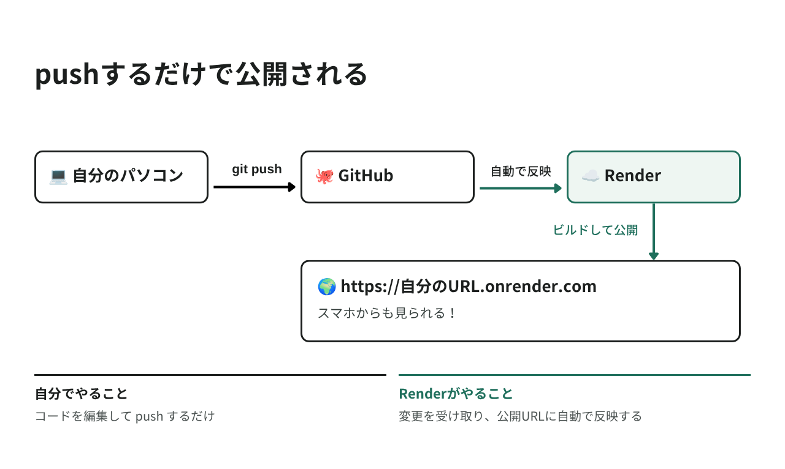

# インターネットに公開しよう

いよいよ最後のステップです。
作ったブログをインターネットに公開して、自分のURLを手に入れましょう。

公開先には Render（レンダー）というサービスを使います。
無料で使えて、クレジットカードの入力も求められません。

## 作業時間の目安

約45〜60分

## このページのゴール



---

## ⚠️ はじめに：知っておいてほしいこと

Render の無料プランには制限があります。あとから「聞いていない」とならないよう、先に伝えます。

| 項目 | 内容 |
|------|------|
| 料金 | 無料。カードの入力は求められません |
| データベースの寿命 | 作成から30日で期限切れ。その後14日で削除されます |
| スリープ | 15分アクセスがないと停止します。次に開くとき約1分かかります |
| 稼働時間 | 月750時間まで |

いちばん大事なのは、データベースが30日で期限切れになることです。
つまり、書いた記事は約1か月で読めなくなります。

> 💡 ずっと残したい場合
> データベースだけ Neon（ニオン）という別サービスの無料プランに置くと、期限がなくなります。
> Neon もカード不要です。まずは Render だけで公開してみて、続けたくなったら相談してください。

> メンター視点
> - 30日で消えることは必ず最初に伝えてください。当日の感動が大きいぶん、あとで気づくと落差が大きいです
> - 「今日の体験が目的」「続けたければ移し替えられる」と両方伝えるとバランスが取れます

---

## 公開の前にひとつだけ準備がいります

Render はいろいろな言語に対応した汎用のサービスで、PHP をそのまま動かす仕組みを持っていません。

そこで Docker（ドッカー）という「アプリを動かす箱の作り方」を書いたファイルを追加します。

> 💡 Docker を理解する必要はありません。
> このページのファイルをコピー＆ペーストするだけで大丈夫です。
> 「PHP を動かす準備を1つのファイルに書いておくもの」くらいの理解で十分です。

### データベースも変わります

コードは1行も変えませんが、記事の保管庫だけが変わります。

公開サーバーのファイルは、更新のたびにリセットされます。
SQLite は「ファイル1つ」にデータを保存するしくみなので、書いた記事が消えてしまいます。
そこで公開サイトでは Postgres（ポストグレス）を使います。

| | 自分のパソコン | 公開サイト |
|---|-------------|-----------|
| データベース | SQLite（ファイル） | Postgres（クラウド） |
| 記事のデータ | 別々です（同期されません） | 別々です |
| コード | 同じ | 同じ |

> 💡 コードを書き換えないのに切り替えられるのは、
> 「どのデータベースを使うか」を Laravel が設定で決めているからです。
> これがフレームワークの便利なところです。

---

## Step 1 Render に登録する

1. [https://render.com/](https://render.com/) を開く
2. 「Get Started」または「Sign Up」をクリック
3. GitHub アカウントでサインインするのが一番かんたんです

カードの入力は求められません。

> メンター視点
> - 06 で GitHub アカウントを作っているので、GitHub でのサインインを勧めてください
> - あとで GitHub のリポジトリと連携するため、同じアカウントで入るのが確実です

---

## Step 2 公開用のファイルを4つ用意する

VS Code で `blog-app` を開いて、以下を作ります。

### 2-1. Dockerfile

`blog-app` フォルダの直下に `Dockerfile` という名前のファイルを作ります（拡張子はありません）。

```dockerfile
# ---------- 1. PHP の部品（vendor）をそろえる ----------
FROM composer:2 AS vendor
WORKDIR /app
COPY composer.json composer.lock ./
RUN composer install --no-dev --no-scripts --no-autoloader --prefer-dist --no-interaction
COPY . .
RUN composer dump-autoload --no-dev --optimize

# ---------- 2. CSS / JS を組み立てる ----------
FROM node:22-alpine AS assets
WORKDIR /app
COPY package.json package-lock.json vite.config.js ./
RUN npm ci
COPY resources ./resources
COPY --from=vendor /app/vendor ./vendor
RUN mkdir -p storage/framework/views && npm run build

# ---------- 3. 本番用イメージ ----------
FROM dunglas/frankenphp:1-php8.4
RUN install-php-extensions pdo_pgsql opcache

# FrankenPHP のバイナリには cap_net_bind_service が付いており、
# 公開サーバーのサンドボックス環境では実行が拒否されることがある
# （Operation not permitted）。1024番未満を使わないので外しておく
RUN setcap -r /usr/local/bin/frankenphp

WORKDIR /app
COPY --from=vendor /app ./
COPY --from=assets /app/public/build ./public/build

RUN mkdir -p storage/framework/{cache,sessions,views} storage/logs bootstrap/cache \
    && chown -R www-data:www-data storage bootstrap/cache

COPY docker-start.sh /usr/local/bin/docker-start.sh
RUN chmod +x /usr/local/bin/docker-start.sh

ENTRYPOINT ["docker-start.sh"]
```

3つの段階に分かれています。

| 段階 | やっていること |
|------|--------------|
| 1 | Composer で PHP の部品をそろえる（05 までにやったことと同じ） |
| 2 | `npm run build` で CSS を組み立てる |
| 3 | 1と2の結果を集めて、動かすための箱にまとめる |

### 2-2. docker-start.sh

同じく直下に `docker-start.sh` を作ります。

```sh
#!/bin/sh
set -e

# Render は待ち受けポートを PORT で渡してくる（ローカルでは 8080）
export SERVER_NAME=":${PORT:-8080}"

# データベースに表を作る（04 でやった php artisan migrate と同じもの）
php artisan migrate --force

# 設定を読み込み済みの状態にしておくと、表示が速くなる
php artisan config:cache
php artisan route:cache
php artisan view:cache

exec frankenphp run --config /etc/frankenphp/Caddyfile --adapter caddyfile
```

公開サイトが起動するたびに、このファイルが実行されます。
04 でやった `php artisan migrate` が、公開サーバー側でも実行される仕組みです。

### 2-3. .dockerignore

同じく直下に `.dockerignore` を作ります。ドットから始まります。

```
.git
.github
node_modules
vendor
public/build
public/hot
storage/logs/*
storage/framework/cache/*
storage/framework/sessions/*
storage/framework/views/*
database/*.sqlite
.env
.env.*
!.env.example
tests
README.md
```

箱に入れなくてよいものの一覧です。`.env` が入っていることを確認してください。
秘密情報を箱に入れないための指定です。

### 2-4. bootstrap/app.php に1行足す

`bootstrap/app.php` を開いて、`withMiddleware` の中を書き換えます。

変更前

```php
    ->withMiddleware(function (Middleware $middleware): void {
        //
    })
```

変更後

```php
    ->withMiddleware(function (Middleware $middleware): void {
        // 公開サーバーでは HTTPS の受付が Laravel の手前で行われるため、
        // 「元は https だった」という情報を信頼して URL を組み立てる
        $middleware->trustProxies(at: '*');
    })
```

> 💡 なぜ必要？
> 公開サイトでは、`https://` の受付を Render が担当し、Laravel には `http://` として届きます。
> そのままだと Laravel が CSS のURLを `http://` で作ってしまい、デザインが読み込まれません。
> この1行で「本当は https だった」と伝えられます。

---

## Step 3 GitHub に反映する

06 で覚えた3ステップです。

```bash
git add .
git commit -m "Renderで公開するための設定を追加"
git push
```

---

## Step 4 データベースを作る

記事を保存する Postgres を用意します。

1. Render のダッシュボードで「New」→「Postgres」を選ぶ
2. 以下を設定する

| 項目 | 設定する内容 |
|------|------------|
| Name | `blog-db`（好きな名前でOK） |
| Database / User | 空欄のままでOK（自動でつきます） |
| Region | Singapore（日本から一番近い） |
| Instance Type | Free |

3. 「Create Database」をクリック

作成には1〜2分かかります。

できあがったら、詳細画面の Connections にある Internal Database URL をコピーしてください。
`postgresql://` で始まる文字列です。Step 6 で使います。

| 種類 | 使いどころ |
|------|-----------|
| Internal Database URL | Render の中から接続する用。今回はこちら |
| External Database URL | 外から接続する用。今回は使いません |

> ⚠️ Region は次の Step 5 と必ず同じにしてください。
> 違うと Internal Database URL では接続できません。

---

## Step 5 Web Service を作る

1. 「New」→「Web Service」を選ぶ
2. GitHub との連携を求められたら許可する
   - private リポジトリの場合、Render の GitHub App にアクセス許可を与える画面が出ます
   - 「All repositories」か、`blog-app` を含めて許可してください
3. `blog-app` リポジトリを選ぶ
4. 以下を設定する

| 項目 | 設定する内容 |
|------|------------|
| Name | `blog-app`（URLの一部になります） |
| Language | Docker |
| Branch | `main` |
| Region | Singapore（Step 4 と同じ） |
| Instance Type | Free |
| Health Check Path | `/up` |

Build Command と Start Command は入力不要です。Step 2 の `Dockerfile` に書いてあるためです。

> メンター視点
> - Language を Docker にし忘れる間違いが起きやすいポイントです
> - Region が Step 4 と揃っているか、ここで一緒に確認してください

---

## Step 6 環境変数を設定する

### 6-1. APP_KEY を作る

自分のパソコンのターミナル（`blog-app` フォルダ）で実行します。

```bash
php artisan key:generate --show
```

`base64:` から始まる文字列が表示されます。これをコピーしてください。

### 6-2. 環境変数を入力する

Web Service の Environment を開き、以下を1件ずつ入力します。

| Key | Value |
|-----|-------|
| `APP_NAME` | 好きなブログ名 |
| `APP_ENV` | `production` |
| `APP_KEY` | 6-1 でコピーした値 |
| `APP_DEBUG` | `false` |
| `DB_CONNECTION` | `pgsql` |
| `DB_URL` | Step 4 でコピーした Internal Database URL |

> ⚠️ `APP_KEY` は末尾まで正確に貼ってください。
> 値には `+` `/` `=` が含まれます。とくに末尾の `=` が落ちやすく、
> 落ちると `Unsupported cipher or incorrect key length` というエラーで公開サイトが開けません。
> まとめて貼り付けるのではなく、1件ずつ入力するのが確実です。

> ⚠️ 変数名は `DB_URL` です。`DATABASE_URL` ではありません。
> ネットの記事には `DATABASE_URL` と書かれたものがありますが、
> それは古い Laravel の書き方です。Laravel 13 は `DB_URL` を見ます。

> ⚠️ `APP_DEBUG=false` は必ず設定してください。
> `true` のままだとエラー画面にソースコードが表示され、誰でも読めてしまいます。

`PORT` は設定しないでください。Render が自動で渡します。

---

## Step 7 公開する

### 7-1. デプロイを待つ

設定を保存すると、自動でデプロイが始まります。初回は5分ほどかかります。

ログで以下が出れば成功です。

```
Running migrations.
  xxxx_create_articles_table ....... DONE
FrankenPHP started 🐘
```

### 7-2. URLを開く

画面上部に表示されているURLを開きます。

```
https://blog-app-xxxx.onrender.com
```

あなたのブログが、インターネットに公開されました！ 🎉

### 7-3. 動作を確認する

| # | やること | 期待する結果 |
|---|---------|------------|
| 1 | トップページを開く | 記事一覧が表示される（デザイン込み） |
| 2 | 記事を書いて公開する | 一覧に表示される |
| 3 | 編集・削除を試す | 反映される |
| 4 | 存在しないURLを開く（`/articles/9999`） | シンプルな 404。エラーの詳細が出ないこと |

4番は `APP_DEBUG=false` が効いているかの確認です。
もしソースコードがずらりと表示されたら、`APP_DEBUG` の設定を見直してください。

> ⚠️ パソコンで書いた記事は入っていません。データベースが別だからです。

---

## これからの更新方法

06 と同じです。`git push` すると自動で反映されます。

```bash
npm run build
git add .
git commit -m "ブログの色を変更"
git push
```

---

## 後片付けのしかた

無料なので費用はかかりませんが、使わなくなったら消しておくと安心です。

1. Web Service の Settings を開き、一番下の「Delete Web Service」
2. Postgres の Settings を開き、「Delete Database」

---

## トラブルシューティング

| 症状 | 原因と対処 |
|------|-----------|
| `Unsupported cipher or incorrect key length` | `APP_KEY` が途中で切れています。末尾の `=` まで入っているか確認 |
| `Connection refused`（127.0.0.1 に接続しようとする） | `DB_URL` が未設定です。`DATABASE_URL` になっていないか確認 |
| `Database file at path [...] does not exist` | `DB_CONNECTION=pgsql` が未設定か、余計な `DB_DATABASE` が残っています |
| `exec: frankenphp: Operation not permitted` | Dockerfile の `RUN setcap -r /usr/local/bin/frankenphp` が抜けています |
| エラー画面にソースコードが出る | `APP_DEBUG=false` を設定してすぐ再デプロイしてください |
| デザインが崩れる | Dockerfile の2段目（`npm run build`）が実行されているかログを確認 |
| 最初のアクセスが遅い | スリープからの復帰です。約1分待つと表示されます。故障ではありません |
| 記事が消えた | 無料 Postgres の30日期限が切れた可能性があります |

---

## 🎉 おめでとうございます！

カードを使わずに、自分のブログをインターネットに公開できました。

URLをスマホに送って開いてみてください。家族や友達にも送れます。

---

次のガイド: [発展課題に挑戦しよう](./08.md)
