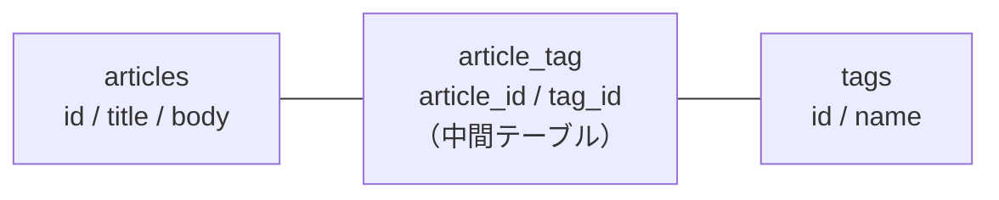

# 発展課題に挑戦しよう

自分のブログを公開できたあなたへ。
ここからは、自分のブログを育てていくための課題集です。

自分のペースで、興味のあるものから挑戦してみてください。

### この課題について

- 中級: 04〜05 で学んだ内容の応用でできる課題
- 上級: 新しい考え方を学びながら挑戦する課題

すべてを完了する必要はありません。1つでもできたら大成功です。

#### 課題の進め方

動くたびに `git push` しましょう。公開中のブログにもすぐ反映されます。
失敗しても、コミットしてあれば戻せます。

> メンター視点
> - 発展課題は自習用です。当日中に終わらなくて問題ありません
> - 公式ドキュメントを読む・検索する、という体験そのものが学習です
> - 完成度より「挑戦したこと」を評価してあげてください

---

## 中級課題

### 課題1: 記事にカテゴリを追加する

記事を「日記」「技術」「グルメ」などに分類できるようにしましょう。

#### やること

1. `articles` テーブルに `category` カラムを追加
2. 新規作成・編集画面にセレクトボックスを追加
3. 記事一覧・記事ページでカテゴリを表示

#### ヒント

新しいマイグレーションを作ります。

```bash
php artisan make:migration add_category_to_articles_table
```

作られたファイルの `up()` に追加します。

```php
$table->string('category')->nullable();
```

そして `php artisan migrate` を実行します。

- `nullable()` をつけると、カテゴリなしでも保存できます（既存の記事があるので必要です）
- `Article` モデルの `#[Fillable([...])]` に `'category'` を追加するのを忘れずに
- セレクトボックスは `<select name="category">` と `<option value="日記">日記</option>`

コントローラーの `store()` と `update()` にも1行ずつ足します。

```php
$validated = $request->validate([
    'title' => 'required|string|max:255',
    'published_on' => 'required|date',
    'body' => 'required|string',
    'category' => 'nullable|string|max:255',   // 追加
]);
```

> ⚠️ ここを忘れると、セレクトボックスで選んでもカテゴリが保存されません。
> エラーも出ないので、原因を見つけにくいところです。
> `validate()` を通った項目だけが `$validated` に入り、それだけが保存されるためです。

> メンター視点
> - 「テーブルに後から列を足す」という実務で最も多い作業を体験できます
> - 保存されないときは `#[Fillable]` と `validate()` の両方を疑うよう伝えてください。
>   どちらか片方だけだと保存されません

---

### 課題2: キーワード検索を追加する

記事をキーワードで検索できるようにしましょう。

#### やること

1. 記事一覧に検索フォームを追加
2. コントローラーでキーワードを受け取る
3. キーワードを含む記事だけを表示

#### ヒント

```php
$keyword = $request->query('keyword');

$query = Article::query();

if ($keyword) {
    $query->where(function ($q) use ($keyword) {
        $q->where('title', 'like', "%{$keyword}%")
          ->orWhere('body', 'like', "%{$keyword}%");
    });
}

$articles = $query->orderBy('published_on', 'desc')->get();
```

- 検索フォームは `<form method="GET">` で作ります
- `like` と `%` は「部分一致で探す」という意味です

> メンター視点
> - `where` の中に関数を入れる書き方は難しいので、まずタイトルだけの検索から始めさせると挫折しにくいです
> - 月別アーカイブと検索を両立させるのは少し難しい課題です。片方ずつでもOKと伝えてください

---

### 課題3: 下書き機能を追加する

「まだ公開したくない記事」を下書きとして保存できるようにしましょう。

#### やること

1. `articles` テーブルに `is_published` カラム（真偽値）を追加
2. 新規作成・編集画面に「公開する／下書き」の切り替えを追加
3. 記事一覧では公開済みの記事だけを表示

#### ヒント

```php
$table->boolean('is_published')->default(true);
```

- `boolean` は「はい／いいえ」を保存する型です
- 一覧の絞り込みは `Article::where('is_published', true)`
- `Article` モデルの `#[Fillable([...])]` に `'is_published'` を追加します

チェックボックスは、外したときに何も送られてきません。
そのため `validate()` ではなく `$request->boolean()` で受け取り、保存する値に足します。

```php
$validated['is_published'] = $request->boolean('is_published');

Article::create($validated);
```

> ⚠️ 課題1と同じで、保存する値に足す1行を忘れると、下書きにしたつもりが公開されます。

> メンター視点
> - `default(true)` にしないと既存の記事が全部消えたように見えるので、必ずつけさせてください
> - 「本物のブログにある機能を自分で作れた」という達成感が大きい課題です

---

### 課題4: 並べ替えを追加する

記事の表示順を切り替えられるようにしましょう。

#### 選択肢の例

- 公開日が新しい順（デフォルト）
- 公開日が古い順
- 最近更新した順

#### ヒント

- セレクトボックスで並べ替え条件を選び、URLパラメータで渡します
- `orderBy('published_on', 'desc')` …新しい順
- `orderBy('published_on', 'asc')` …古い順
- `orderBy('updated_at', 'desc')` …最近更新した順

> メンター視点
> - `published_on`（公開日）と `updated_at`（更新日時）の違いを説明する良い機会です

---

### 課題5: ページネーションを追加する

記事が増えてきたら、ページ分割しましょう。

#### ヒント

コントローラーの `get()` を `paginate()` に変えるだけです。

```php
$articles = Article::orderBy('published_on', 'desc')->paginate(10);
```

ビューの最後にページ送りを追加します。

```blade
{{ $articles->links() }}
```

- `paginate(10)` は「1ページに10件」という意味です
- 検索や絞り込みと併用するときは `->appends(request()->query())` が必要です

#### 参考リンク

- [ページネーション（日本語ドキュメント）](https://readouble.com/laravel/13.x/ja/pagination.html)

> メンター視点
> - たった2行で本格的な機能が入るので、Laravel の便利さを実感できる課題です

---

## 上級課題

### 課題6: ログイン機能を追加する（おすすめ）

今のブログは、URLを知っていれば誰でも記事を書けてしまいます。
「読むのは誰でもOK、書けるのは自分だけ」にしましょう。

#### 完成イメージ

| | 一覧・記事ページ | 作成・編集・削除 |
|---|---|---|
| 訪問者 | 読める | 入れない |
| ログイン中の自分 | 読める | 書ける |

#### 学ぶこと

- 認証（Authentication）: ユーザーを識別するしくみ
- ミドルウェア: ルートに「ログイン必須」の条件をつけるしくみ
- Laravel Fortify: 認証機能を提供する公式パッケージ

#### やり方1: 新しいプロジェクトでスターターキットを試す（おすすめ）

Laravel には、認証機能が最初から入ったテンプレートが用意されています。
まずは別のプロジェクトで、どんなものか触ってみるのが安全です。

```bash
laravel new auth-sample
# 「Do you want to use a starter kit?」で Yes を選ぶ
# 「Which frontend stack...?」で Livewire を選ぶ（PHPだけで書けます）

cd auth-sample
npm install && npm run build
php artisan migrate
php artisan serve
```

`/register` からユーザー登録、`/login` からログインができます。

| スターターキット | 特徴 |
|----------------|------|
| Livewire | PHP だけで動的なUIが書ける。Blade に慣れている今回はこれが一番近い |
| React | React + TypeScript。SPA 向け |
| Vue | Vue + TypeScript。SPA 向け |
| Svelte | Svelte + TypeScript。SPA 向け |

#### やり方2: 今のブログに認証を足す

既存プロジェクトに追加する場合は、Fortify を直接入れます。

```bash
composer require laravel/fortify
php artisan fortify:install
php artisan migrate
```

そのあと、次の3つが必要です。どれか1つでも抜けると動きません。

##### ① ログイン画面のビューを用意して、Fortify に教える

`resources/views/auth/login.blade.php` を作り、メールアドレスとパスワードの
フォーム（送信先は `POST /login`）を書きます。`@csrf` を忘れずに。

ビューを作るだけでは足りません。`app/Providers/FortifyServiceProvider.php` の
`boot()` に、どのビューを使うかを教える1行を足します。

```php
Fortify::loginView(fn () => view('auth.login'));
```

> ⚠️ この1行がないと、`/login` を開いたときに
> `Target [Laravel\Fortify\Contracts\LoginViewResponse] is not instantiable.`
> というエラーが出ます。「ビューが無い」とは書かれていないので気づきにくいところです。

##### ② ログイン後の行き先を変える

Fortify は初期設定でログイン後に `/home` へ飛ばしますが、このブログに `/home` はありません。
`config/fortify.php` を開いて、行き先を記事一覧に変えます。

```php
'home' => '/',
```

##### ③ 書き込み系のルートだけを保護する

`routes/web.php` を、次のように書き換えます。

```php
// 誰でも読める（記事一覧）
Route::get('/', [ArticleController::class, 'index'])->name('articles.index');

// ログインが必要
Route::middleware('auth')->group(function () {
    Route::get('/articles/create', [ArticleController::class, 'create'])->name('articles.create');
    Route::post('/articles', [ArticleController::class, 'store'])->name('articles.store');
    Route::get('/articles/{article}/edit', [ArticleController::class, 'edit'])->name('articles.edit');
    Route::put('/articles/{article}', [ArticleController::class, 'update'])->name('articles.update');
    Route::delete('/articles/{article}', [ArticleController::class, 'destroy'])->name('articles.destroy');
});

// 誰でも読める（記事ページ）
Route::get('/articles/{article}', [ArticleController::class, 'show'])->name('articles.show');
```

> ⚠️ `/articles/create` は `/articles/{article}` より上に書く必要があります（04 参照）。
> 上の例で記事ページ（`show`）を一番下に置いているのは、そのためです。
> グループを分けると順番が崩れやすいので、書き終わったら `php artisan route:list` で確認してください。

うまくいくと、こうなります。

| 状態 | `/`・記事ページ | `/articles/create` |
|---|---|---|
| 未ログイン | 表示される | `/login` に飛ばされる |
| ログイン中 | 表示される | 表示される |

#### 参考リンク

- [スターターキット（日本語）](https://readouble.com/laravel/13.x/ja/starter-kits.html)
- [Fortify（日本語）](https://readouble.com/laravel/13.x/ja/fortify.html)
- [認証（日本語）](https://readouble.com/laravel/13.x/ja/authentication.html)

> メンター視点
> - 既存プロジェクトへの Fortify 追加は難易度が高めです。まずスターターキットで動くものを見せるのが近道です
> - 「公開ブログなのに誰でも書ける」という現状の問題を先に体験させると、学習の動機になります
> - つまずくのはほぼ ①〜③ のどれかです。500 が出たら ①、ログイン後に 404 なら ②、
>   「新しい記事」で 404 なら ③ を疑ってください

---

### 課題7: アイキャッチ画像を添付する

記事に写真を付けられるようにしましょう。

#### 学ぶこと

- ファイルアップロード: `$request->file('image')`
- ストレージ: Laravel のファイル保存機能

#### ヒント

- フォームに `enctype="multipart/form-data"` が必要です
- 保存: `$path = $request->file('image')->store('articles', 'public');`
- 表示: `image_path) }}">`
- ローカルでは `php artisan storage:link` が必要です

> ⚠️ 公開サイトでの注意
> Render の無料プランは、デプロイやスリープのたびにファイルが消えるため、
> アップロードした画像はオブジェクトストレージ（S3互換）に保存する必要があります。
> ローカルで動かすところまでを目標にするのがおすすめです。

#### 参考リンク

- [ファイルストレージ（日本語）](https://readouble.com/laravel/13.x/ja/filesystem.html)

> メンター視点
> - セキュリティ（ファイル形式・サイズの検証）に触れる良い機会です
> - `'image' => 'nullable|image|max:2048'` のようなバリデーションを一緒に書いてみてください

---

### 課題8: タグ機能を追加する

記事に複数のタグ（`#グルメ` `#写真` `#おでかけ` など）を付けられるようにしましょう。

#### 学ぶこと

- 多対多リレーション: 1記事に複数タグ、1タグに複数記事
- 中間テーブル: 関連を管理する専用のテーブル

#### 必要なテーブル



#### ヒント

`Article` モデルに追加します。

```php
public function tags()
{
    return $this->belongsToMany(Tag::class);
}
```

- 中間テーブルの名前はアルファベット順・単数形（`article_tag`）が規約です
- タグを付ける: `$article->tags()->sync($tagIds);`

#### 参考リンク

- [Eloquent リレーション - 多対多（日本語）](https://readouble.com/laravel/13.x/ja/eloquent-relationships.html#many-to-many)

> メンター視点
> - データベース設計の考え方に触れられる、実務直結の課題です
> - いきなり全部作らず、「まず tags テーブルを作る」から始めさせてください

---

### 課題9: Markdown（マークダウン）対応にする

記事を Markdown 記法で書けるようにしましょう。

#### 完成イメージ

```markdown
# 今日のハイライト

- ランチに **美味しいラーメン** を食べた
- 新しい本を読み始めた

> 明日も頑張ろう！
```

↓ 表示するときは、見出し・太字・箇条書きに変換される

#### 学ぶこと

- Composer パッケージ: 外部ライブラリを導入する流れ
- Markdown パーサー: テキストを HTML に変換するしくみ
- XSS対策: 危険なHTMLを取り除く

#### ヒント

```bash
composer require league/commonmark
```

変換するときに、安全のための設定を2つ渡します。

```php
use League\CommonMark\CommonMarkConverter;

$converter = new CommonMarkConverter([
    'html_input' => 'strip',          // 本文に書かれた HTML タグを取り除く
    'allow_unsafe_links' => false,    // javascript: などの危険なリンクを無効にする
]);

$html = $converter->convert($article->body);
```

- 変換した HTML は `{!! !!}` で出力しますが、そのままだと危険です
- `html_input` だけでは足りません。設定を1つにすると、こうなります

| 設定 | `[リンク](javascript:alert(1))` の出力 |
|---|---|
| `html_input` だけ | `<a href="javascript:alert(1)">リンク</a>`（危険なまま） |
| `allow_unsafe_links` も指定 | `<a>リンク</a>`（無効化される） |

> メンター視点
> - 「`{!! !!}` を使うときは必ずサニタイズ」というセキュリティの原則を伝える良い機会です
> - 05 で使った `e()` の話とつなげると理解が深まります
> - `<script>` は `html_input` で消えますが、`javascript:` リンクは残ります。
>   「1つ設定したから安心」とはならない例として使えます

---

## 課題に取り組むときのアドバイス

### 1. 小さく始める

一度に全部作ろうとせず、小さな部分から始めましょう。

- ❌ いきなり完璧なタグ機能を作ろうとする
- ✅ まず `tags` テーブルだけ作って、`php artisan migrate` で動くことを確認する
- ✅ そこから少しずつ足していく

### 2. エラーを恐れない

エラーは「何が問題かを教えてくれるメッセージ」です。

### 3. 動いたらコミット

小さな単位で動作確認し、動いたらコミットしましょう。

```bash
git add .
git commit -m "カテゴリ機能を追加"
git push
```

こうすると、失敗してもいつでも戻れます。しかも公開サイトにも反映されます。

### 4. 調べ方を覚える

プログラミングは「調べながら作る」のが普通です。プロも毎日調べています。

| 調べ先 | 使いどころ |
|--------|-----------|
| [Laravel 日本語ドキュメント](https://readouble.com/laravel/13.x/ja/) | 「正しいやり方」を知りたいとき |
| エラーメッセージで検索 | エラーの意味が分からないとき |
| [Laravel 公式ドキュメント（英語）](https://laravel.com/docs/13.x) | 日本語版に情報がないとき |

> ⚠️ 検索で出てくる記事は Laravel 10 / 11 / 12 のものが多いです。
> バージョンを必ず確認してください。

---

## おすすめの進め方

#### まず1つやってみたい方

1. 課題1: カテゴリを追加… 04 の復習になります
2. 課題3: 下書き機能…ブログらしさが一気に増します
3. 課題2: キーワード検索…実用的で達成感があります

#### もっと挑戦したい方

4. 課題6: ログイン機能…本物の公開ブログに近づきます
5. 課題8: タグ機能…データベース設計を学べます

---

## 困ったときは

- 公式ドキュメント: [Laravel 日本語ドキュメント](https://readouble.com/laravel/13.x/ja/)
- 検索: エラーメッセージをそのままコピーして検索
- 質問: メンターや勉強会で質問する

一人で抱え込まず、どんどん質問してください。質問することも大切なスキルです！

---

最後に

ここまで読んでくださり、ありがとうございました。

あなたはもう、動くWebアプリを作って、インターネットに公開した経験があります。
これは、多くの人が「いつかやってみたい」で終わってしまうことです。

プログラミングは、作れば作るほど楽しくなります。
このブログを、自分だけのオリジナルなサービスに育てていってください。

---

[ガイド一覧に戻る](./README.md)
